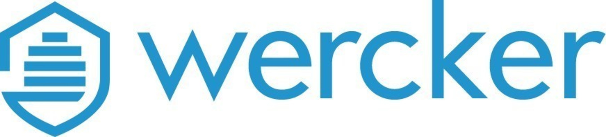

# **Bitbucket Pipelines**

## **Índice**
[Portada](#id1) 
[Índice](#id2) 
[Introducción](#id3) 
[Lenguajes con los que trabaja](#id4) 
[Identificación](#id5) 
[Ejemplo](#id6) 

## **Introducción**
Wercker es una herramienta de Integración Continua (CI) y Despliegue Continuo
(CD) que ayuda a los desarrolladores a crear, probar e
implementar las aplicaciones. Estos contenedores se pueden
 automatizar los procesos de creación e
implementación, probando dichos procesos y después implementarlos en varias
plataformas en la nube, como Heroku, AWS y Rackspace. Además, es propiedad de
Oracle.

## **Lenguajes con los que trabaja**
Los lenguajes de programación con los que son compatibles son:
Python, Goland (Go), Java (Grandle o Maven), NodeJS y Ruby.

## **Identificación**
Para identificarse es muy fácil: podemos crearnos una cuenta, o incluso vincular nuestra cuenta de Github o Oracle Cloud. En este caso, logueamos con Github. Nos pedirá la autorización de usar nuestra cuenta de Github, y poniendo el nombre de usuario que queremos tener en Wercker y contraseña.

Una vez realizado, podemos crear una aplicación: en este caso, haremos la aplicación mítica Hola Mundo.

## **Ejemplo**
Nos mostrará cuál es el repositorio de Github que queremos vincular, luego la clave SSH que por defecto Wercker recomienda no usarlo, y ya con esto creamos el proyecto.

Se nos pedirá en qué lenguaje queremos ejecutar el Hola Mundo, y en este caso, usamos Goland (Go). Para ello, en nuestro repositorio de Github creamos un archivo YAML llamado wercker.yml, donde ponemos el código YAML

Una vez commiteado el repositorio, automáticamente Wercker empieza a hacer los procesos de trabajo para verificar que nuestra aplicación se encuentra en perfecto estado.

Para finalizar, se nos mostrará que nuestra aplicación ha dado el OK y que tendremos los datos de la aplicación a través de una API.

> Página oficial:
> https://app.wercker.com/

> Documentación
> https://en.wikipedia.org/wiki/Wercker

> GitHub:
> https://github.com/Jorgeev27/

