# Amplify

> "Cree aplicaciones móviles y web de pila completa extensibles con mayor rapidez. Fácil de comenzar, fácil de escalar."


## Índice
- <a href="#1">Introducción</a>
- <a href="#2">Herramientas relacionadas</a>
- <a href="#3">Registro, Costes e interfaz</a>
- <a href="#4">Amplify Studio</a>
- <a href="#5">Amplify Cli</a>
- <a href="#6">Conclusión</a>


# <a name="1">Introducción</a>

AWS Amplify es un conjunto de herramientas y características que facilitan y aceleran la creación de aplicaciones de pila completa tanto en movil como web. Permite configurar el backend de una aplicación y conectarla en cuestión de minutos, así como creae una interfaz de usuario y administrar el contenido de la aplicación fuera de la consola de AWS.

> "Envíe de manera más rápida y escale sin esfuerzo"

Amplify tiene diferentes casos de uso, como son:

* Incorporación de autenticación de usuarios
* Creación de un modelo de datos de backend
* Creación visual de una backend y una interfaz de usuario
* Alijar una aplicación web progresiva o sitio estático

También cuenta con diferentes herramientas:

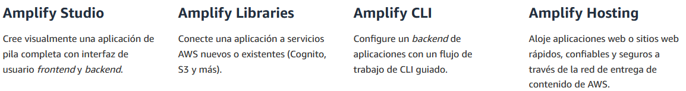

Si comparamos el mercado de este servicio y el de Jenkins, podemos apreciar que triunfa más en las pequeñas empresas.

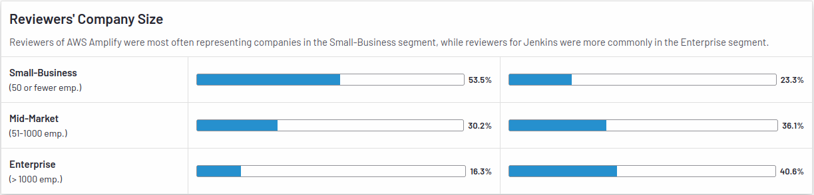


# <a name="2">Herramientas relacionadas</a>

Amplify permite la conexión con otras herramientas para recoger código y desplegarlo en la nube, estas son:

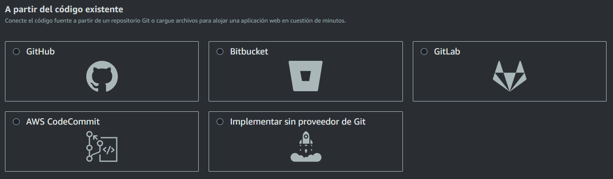

También nos permite crear facilmente proyectos gracias a su integración con las siguientes tecnologías y lenguajes:

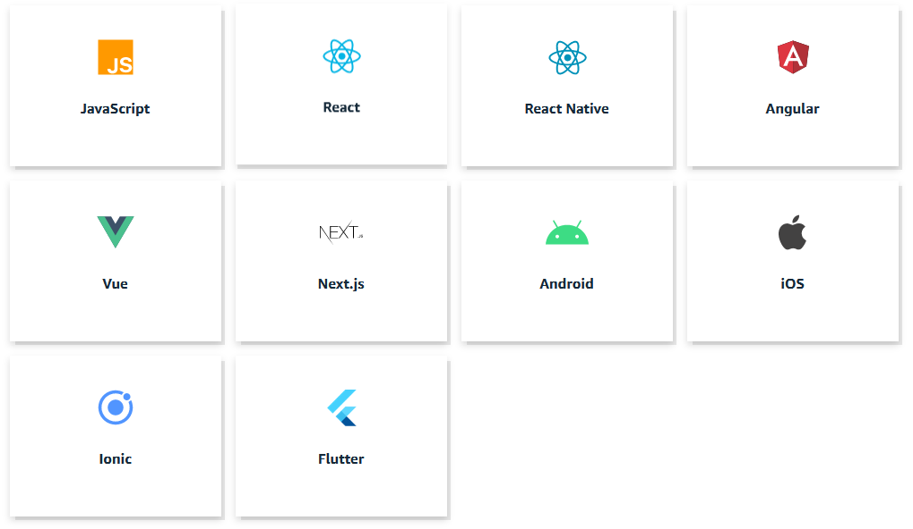


# <a name="3">Registro, Costes e interfaz</a>

El registro en la plataforma es relativamente sencillo, lo único de lo que deberán preocuparse es de no fallar los CAPTCHA y de tener 1 eurito en la tarjeta.

AWS Amplify cuenta con diferentes planes que nos presentarán desde el inicio, los cuales son:


La interfaz principal de usuario es la siguiente:

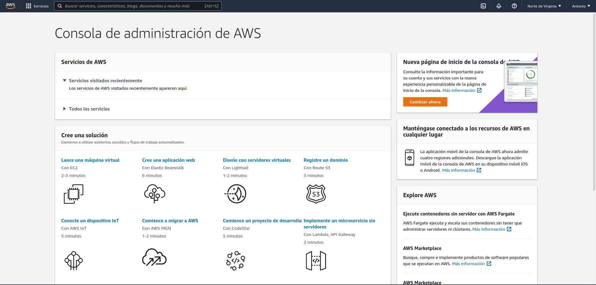

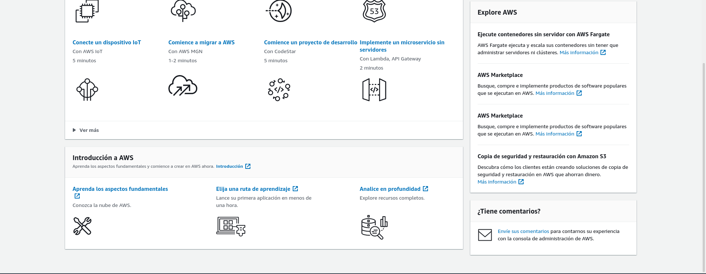

Aunque esta es relamente una versión antigua la cual te permiten modificar desde el comienzo:

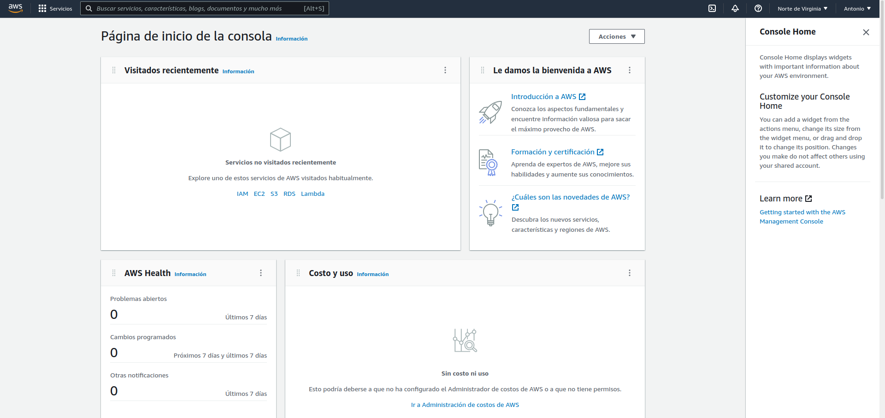

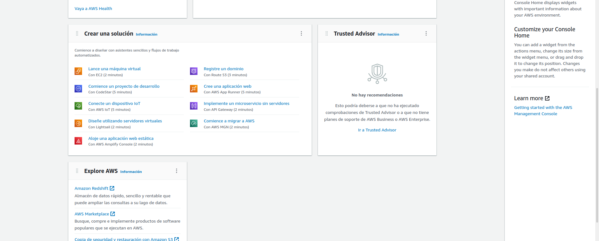


# <a name="4">Amplify Studio</a>

Un forma fácil, rápida y gráfica de crear una aplicación.

Accediendo a la herramienta nos llevará a su página, donde podremos elegir el tipo de aplicación a construir:

* Blog: Una aplicación con base de datos multitabla y relacionadas para la creación, por ejemplo, de un blog.
* To-do list: Una aplicación con una sola tabla que nos permitirá crear una lista de notas, por ejemplo.
* Blank data model: Un modelo en blanco para explotar nuestra creatividad.

Y también el tipo de integración que quieremos, estando disponibles las anteriormente vistas.

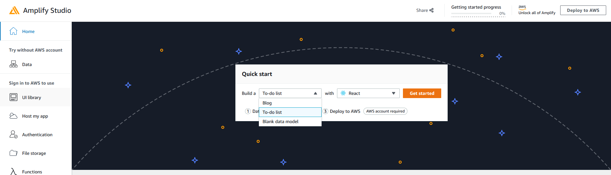

Lo siguiente será configurar el modelo.

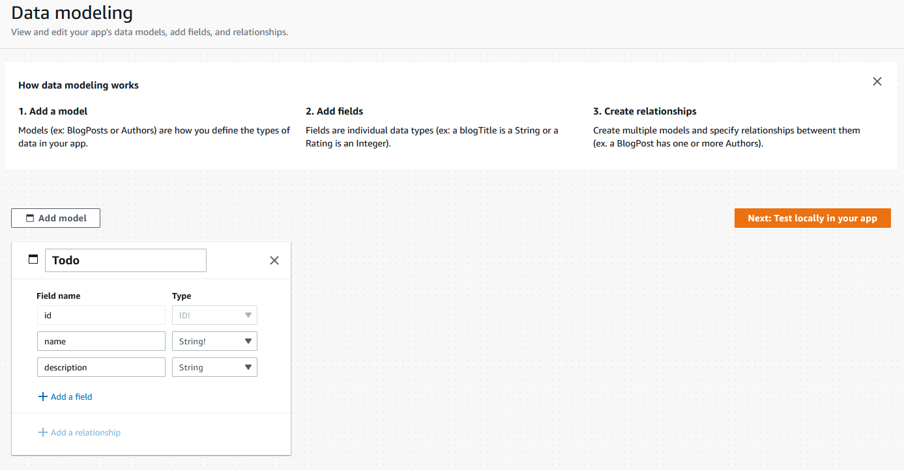

El cual modificaré un poco para hacer una sencilla aplicación que guarde notas.

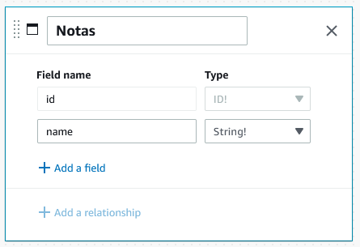

Amplify nos mostrará los comandos necesarios para descargar el cliente en local así como nuestra aplicación.

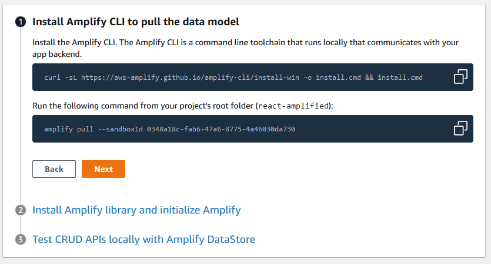

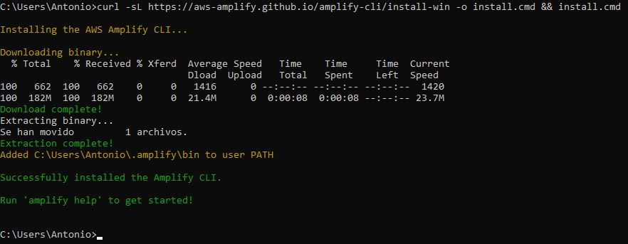

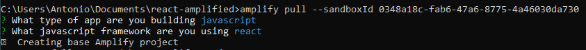

El siguiente paso es instalar las librerias de amplify.

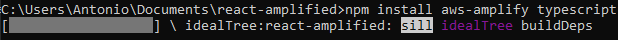

Y pegar en nuestra aplicación las funcionalidades que deseemos.

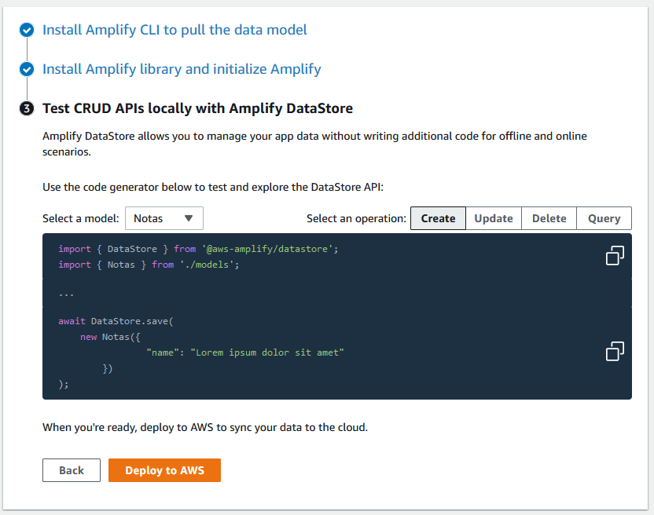

El proyecto descargado realmente no tiene mas que librerias y estructura, no crea los ficheros básicos de ningún tipo (index, ficheros .js, etc.) por lo que usando la estructura de otras guías los creo, entre ellos el index con el CRUD.

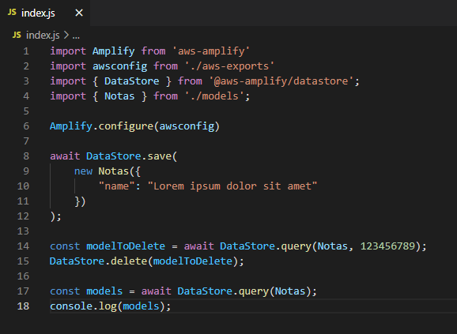

Pulsando Deploy nos llevará a la página de despliegue de amplify, donde le daremos nombre a la app y elegiremos servidor.

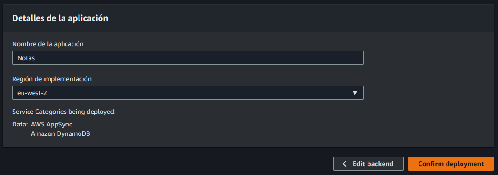

Y esperamos...

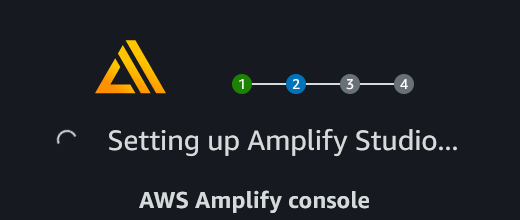

Al finalizar tendremos esta ventana.

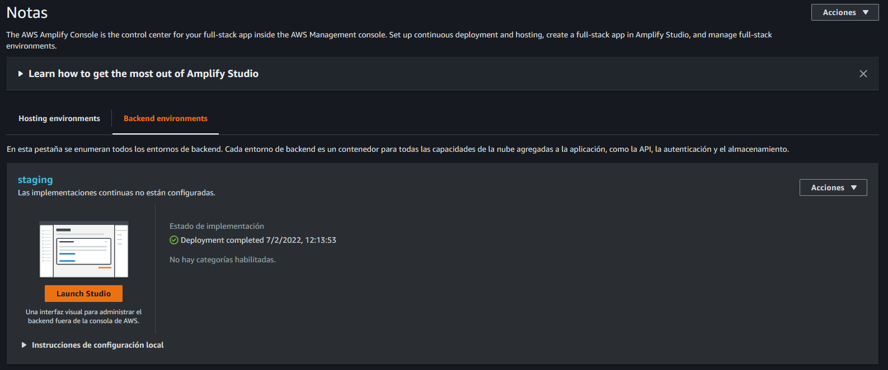

En las instrucciones de configuración local nos indican que ejecutemos el siguiente comando para conectar nuestra app.


El cual obviamente no es un comando, de todas formas instalo el cliente de amplify y lo configuro con su usuario para hacer algunas pruebas.

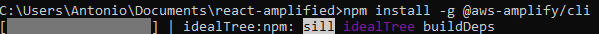

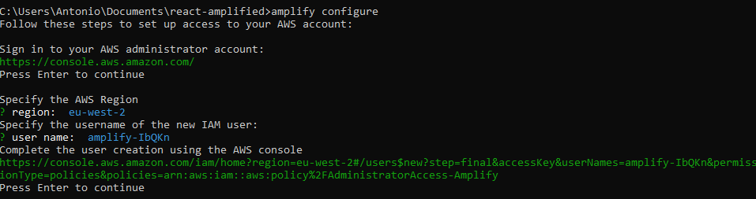

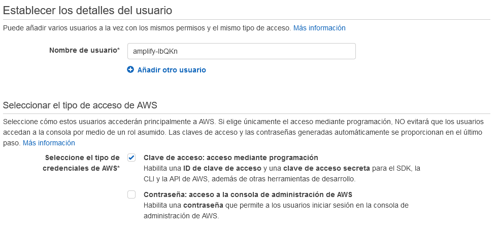

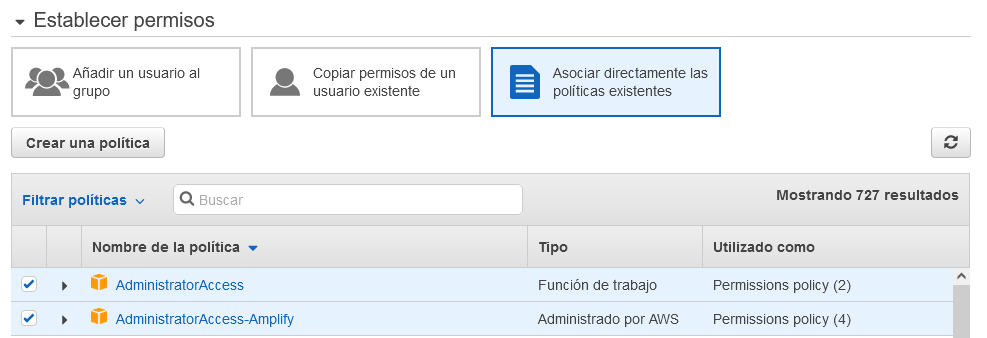

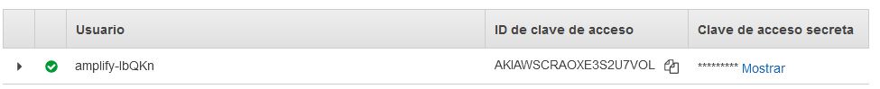

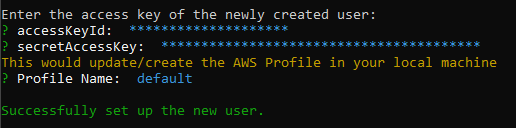

Luego de probar algunos comandos de la guía y otros que encontré por internet, incluso lo inicialicé como un nuevo proyecto dejando de lado "Studio".

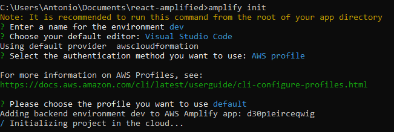

No conseguí conectarlo apropiadamente.

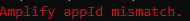

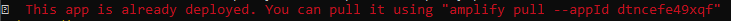

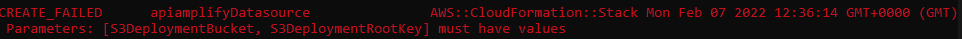


# <a name="5">Amplify Cli</a>

Para utilizar amplify cli necesitamos:

* Node.js v12.x o más
* npm v5.x o más
* git v2.14.1 o más

Lo primero será instalar el cliente, en nuestro caso, en liux.

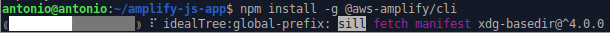

Y configurarlo.

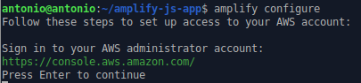

Nos pedirá iniciar sesión.


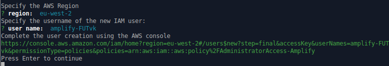

Y configurar un nuevo usuario administrador.

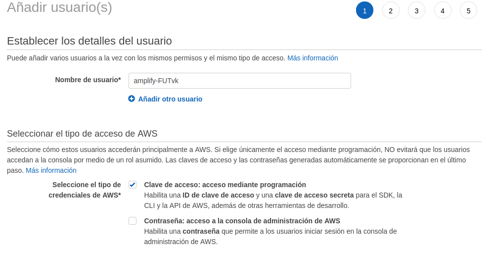

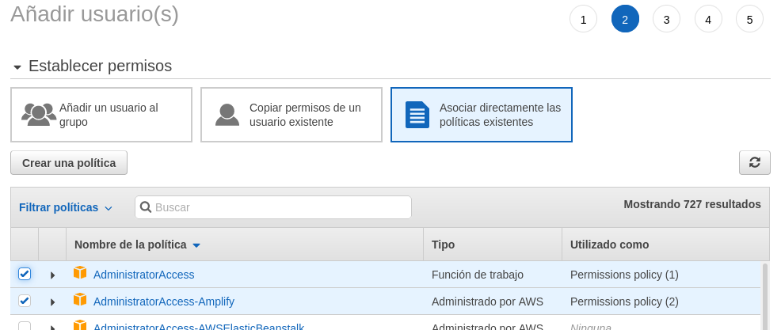

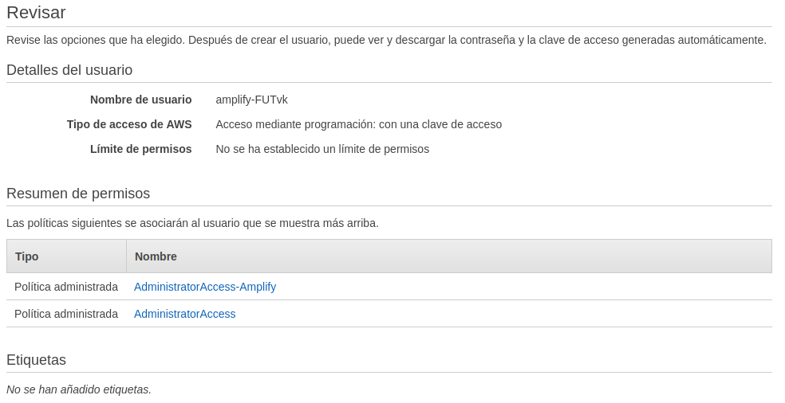

Al terminar no dará sus claves, las cuales introduciremos en el siguiente paso.

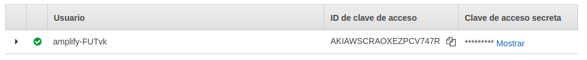

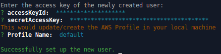

A continuación creamos la carpeta del proyecto, su estructura y contenido.

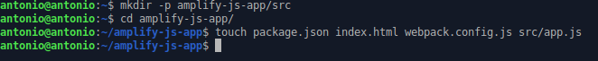

Pegamos el siguiente contenido en el fichero **package.json**.

```json
{
  "name": "amplify-js-app",
  "version": "1.0.0",
  "description": "Amplify JavaScript Example",
  "dependencies": {
    "aws-amplify": "latest"
  },
  "devDependencies": {
    "copy-webpack-plugin": "^6.1.0",
    "webpack": "^4.46.0",
    "webpack-cli": "^4.9.1",
    "webpack-dev-server": "^4.4.0"
  },
  "scripts": {
    "start": "webpack && webpack-dev-server --mode development",
    "build": "webpack"
  }
}
```

E instalamos las dependencias.

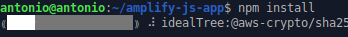

Añadimos el siguiente contenido al **index.html**.

```html
<!DOCTYPE html>
<html lang="en">
  <head>
    <meta charset="utf-8" />
    <title>Amplify Framework</title>
    <meta name="viewport" content="width=device-width, initial-scale=1" />
    <style>
      html, body { font-family: "Amazon Ember", "Helvetica", "sans-serif"; margin: 0; }
      a { color: #ff9900; }
      h1 { font-weight: 300; }
      hr { height: 1px; background: lightgray; border: none; }
      .app { width: 100%; }
      .app-header { color: white; text-align: center; background: linear-gradient(30deg, #f90 55%, #ffc300); width: 100%; margin: 0 0 1em 0; padding: 3em 0 3em 0; box-shadow: 1px 2px 4px rgba(0, 0, 0, 0.3); }
      .app-logo { width: 126px; margin: 0 auto; }
      .app-body { width: 400px; margin: 0 auto; text-align: center; }
      .app-body button { background-color: #ff9900; font-size: 14px; color: white; text-transform: uppercase; padding: 1em; border: none; }
      .app-body button:hover { opacity: 0.8; }
    </style>
  </head>

  <body>
    <div class="app">
      <div class="app-header">
        <div class="app-logo">
          
        </div>
        <h1>Welcome to the Amplify Framework</h1>
      </div>
      <div class="app-body">
        <h1>Mutation Results</h1>
        <button id="MutationEventButton">Add data</button>
        <div id="MutationResult"></div>
        <hr />

        <h1>Query Results</h1>
        <div id="QueryResult"></div>
        <hr />

        <h1>Subscription Results</h1>
        <div id="SubscriptionResult"></div>
      </div>
    </div>
    <script src="main.bundle.js"></script>
  </body>
</html>
```

Y lo siguiente a **webpack.config.js**.

```js
const CopyWebpackPlugin = require('copy-webpack-plugin');
const webpack = require('webpack');
const path = require('path');

module.exports = {
  mode: 'development',
  entry: './src/app.js',
  output: {
    filename: '[name].bundle.js',
    path: path.resolve(__dirname, 'dist')
  },
  module: {
    rules: [
      {
        test: /\.js$/,
        exclude: /node_modules/
      },
    ]
  },
  devServer: {
    client: {
      overlay: true
    },
    hot: true,
    watchFiles: ['src/*', 'index.html']
  },
  plugins: [
    new CopyWebpackPlugin({
      patterns: ['index.html']
    }),
    new webpack.HotModuleReplacementPlugin()
  ]
};
```

Ya podemos iniciar la aplicación en local para probarla, aunque ahora mismo no hace nada.

PERO PRIMERO, cabe destacar que amplify no se lleva bien con las últimas version de **npm** y este comando puede dar muchos problemas, por lo que despues de una busqueda y algunas soluciones poco prácticas, la solución mas simple es uitilizar una versión inferior a las 17.


Y ahora si iniciamos la app.

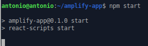

La cual se mostrará en el puerto **8080**.

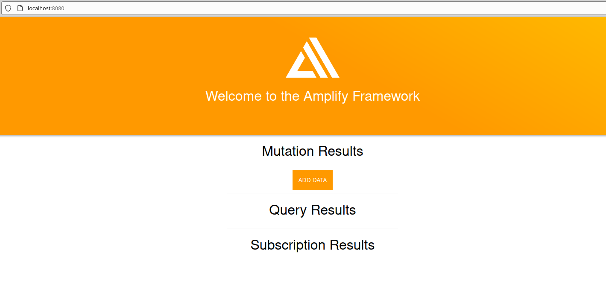

Lo siguiente será inicializar un backend.

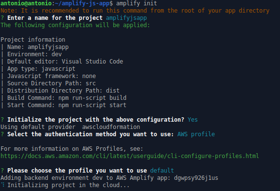

Y crear una API y base de datos.

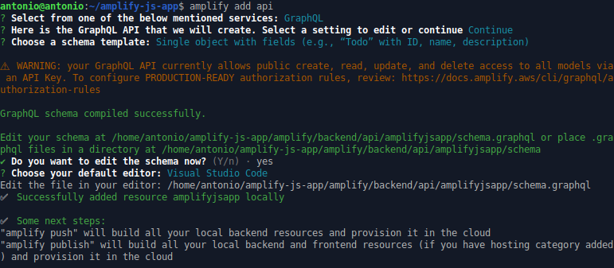

Esto último abrirá el archivo con nuestro editor seleccionada y veremos el esquema por defecto, el cual dejaremos.

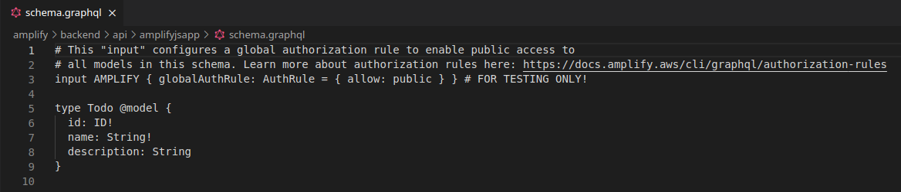

Ahora subimos nuestra configuración a la nube para poder desplegar la aplicación.

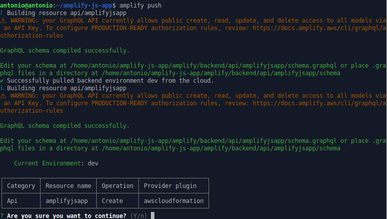

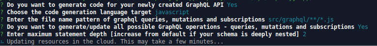

Al termiar podemos consultar el estado de amplify ejecutando:


Vamos a conectar el frontend a la API, sustituyendo el contenido de **app.js** por el siguiente:

```js
import Amplify, { API, graphqlOperation } from "aws-amplify";

 import awsconfig from "./aws-exports";
 import { createTodo } from "./graphql/mutations";
 import { listTodos } from "./graphql/queries";
 import { onCreateTodo } from "./graphql/subscriptions";

 Amplify.configure(awsconfig);

 async function createNewTodo() {
   const todo = {
     name: "Use AppSync",
     description: `Realtime and Offline (${new Date().toLocaleString()})`,
   };

   return await API.graphql(graphqlOperation(createTodo, { input: todo }));
 }

 async function getData() {
   API.graphql(graphqlOperation(listTodos)).then((evt) => {
     evt.data.listTodos.items.map((todo, i) => {
       QueryResult.innerHTML += `<p>${todo.name} - ${todo.description}</p>`;
     });
   });
 }

 const MutationButton = document.getElementById("MutationEventButton");
 const MutationResult = document.getElementById("MutationResult");
 const QueryResult = document.getElementById("QueryResult");
+const SubscriptionResult = document.getElementById("SubscriptionResult");

 MutationButton.addEventListener("click", (evt) => {
   createNewTodo().then((evt) => {
     MutationResult.innerHTML += `<p>${evt.data.createTodo.name} - ${evt.data.createTodo.description}</p>`;
   });
 });

 API.graphql(graphqlOperation(onCreateTodo)).subscribe({
   next: (evt) => {
     const todo = evt.value.data.onCreateTodo;
     SubscriptionResult.innerHTML += `<p>${todo.name} - ${todo.description}</p>`;
   },
 });

 getData();
```

Podemos comprobar su funcionamiento de nuevo, viendo que ahora si responde al pulsar el botón.

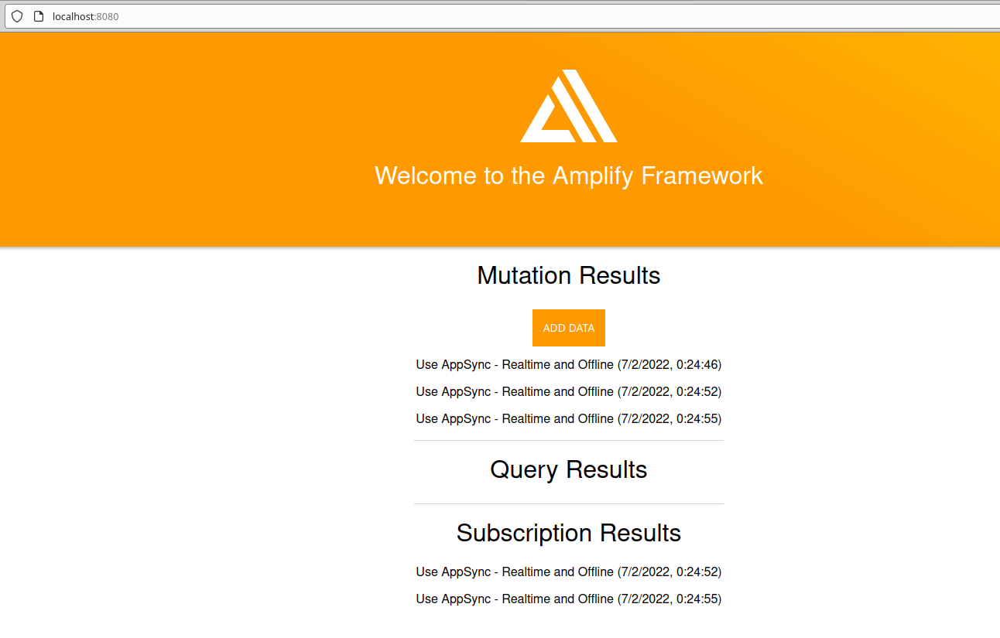

Vamos a añadir un hosting a nuestra app.

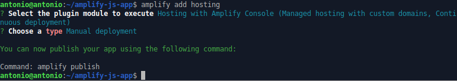

Y publicar nuestra app.

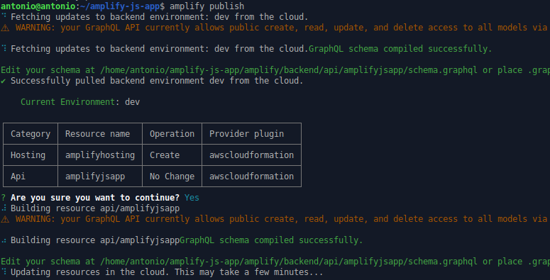

Al terminar nos mostrará la URL donde se encuentra desplegada.

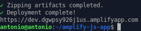

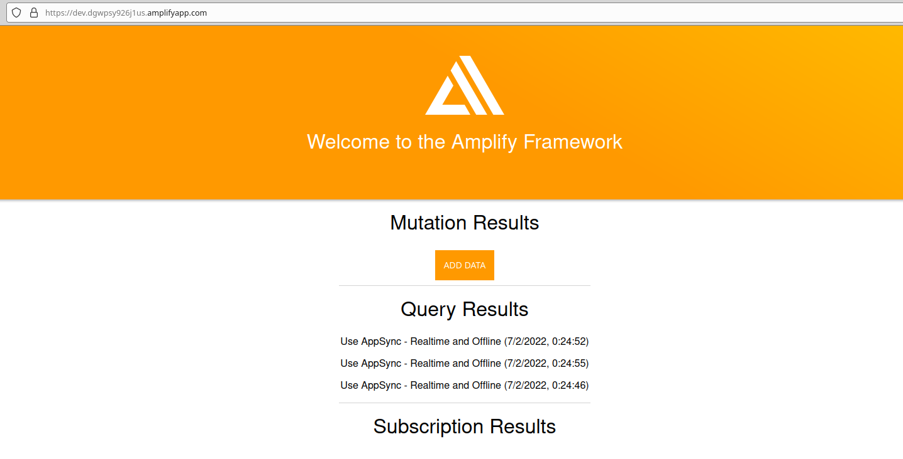

Podemos ver nuestra aplicación desde la consola de administración de AWS.

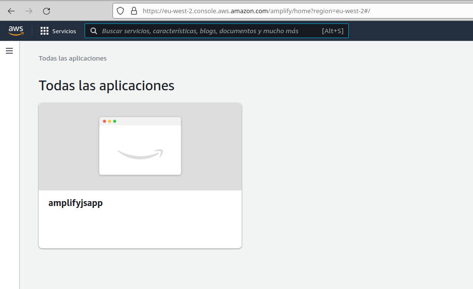

Donde podemos comprobar su estado.

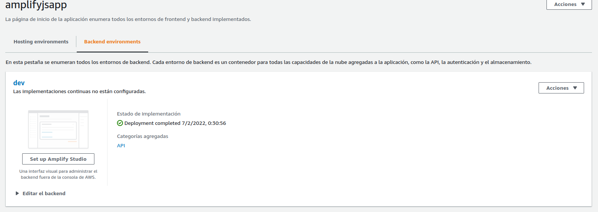


# <a name="6">Conclusión</a>

Junto a estos ejemplo, he hecho dos pruebas más, cabe destacar que ninguna ha funcionado, si bien amplify cuenta con una extensa guía (la cual decir que está un poco escondida al final de la página), no todo funciona correctamente, además que se encuentra en inglés.

Solo encontré una guía oficial en español que indicaba como desplegar una aplicación utilizando GitHub, la cual fue la primera en probar, pero si bien la guía era de 2021, esta completamente desfasada, los componentes básicos de la aplicación ya no existían en los repositorio al importarlo, y los nuevos funcionaban completamente diferente.

Aunque intenté adaptar esto lo más que pude, finalmente aunque en local funcionaba, amplify no era capaz de desplegarlo con los comandos generados por él mismo.

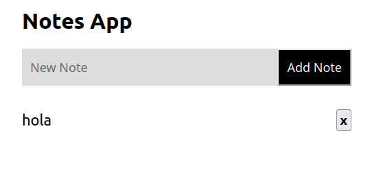


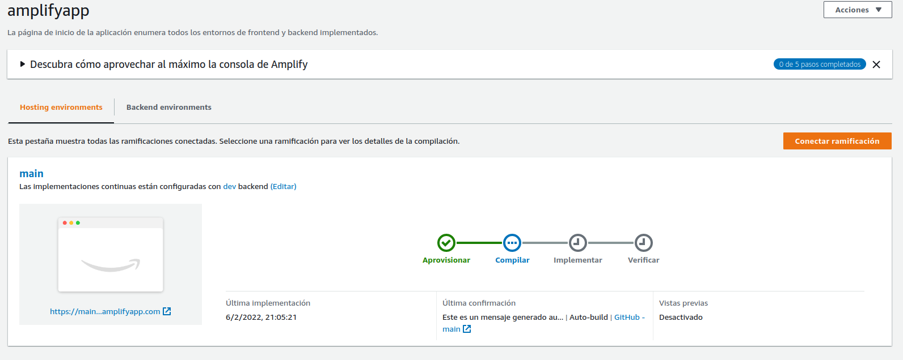

En conclusión, es cierto lo que dicen, te permite crear aplicacion visualmente de forma rápida, facil y sin experiencia en la nube, pero no terminan de guiarte del todo bien y se te puede hacer complicado conseguir que todo funcione ya no con experiencia en la nube, sino con experiencia en el servicio.

Personalmente no me ha dejado un buen sabor de boca, las herramientas utilizadas en clase me han parecido más sencillas y útiles, además de ser gratuitas.


AWS Amplify [amplify](https://aws.amazon.com/es/amplify/)
Documentación oficial [documentación](https://docs.amplify.aws/)
