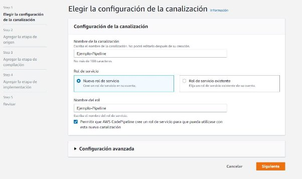
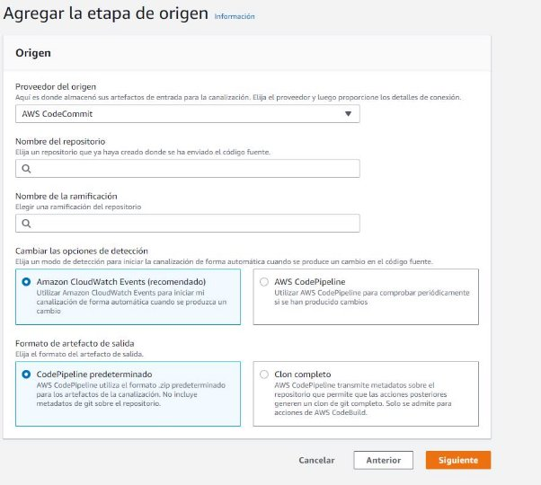
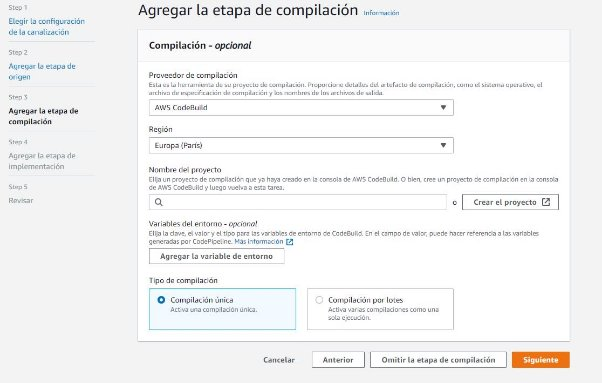
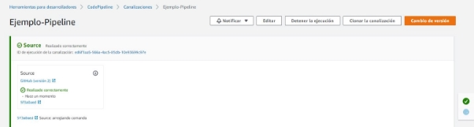

# AWS CodePipeline

## ¿Qué es CodePipeline?

AWS CodePipeline es un servicio de entrega continua completamente administrado que permite automatizar canalizaciones de lanzamiento para lograr actualizaciones de infraestructura y aplicaciones rápidas y fiables.

CodePipeline es uno de los servicios de AWS.Y para poder hacer funcionar este se recomienda hacer uso de todos los servicios de este

## Herramientas con las que se relaciona

CodePipeline se relaciona con diferentes herramientas las cuales son Bitbucket,Jenkins y Github.En cuanto a Github y Bitbucket se usan para almacenar los datos del pipeline.Mientras que Jenkins se puede utilizar para crear el Pipeline y poder tener la interfaz de AWS que es más didáctica.

## Definición y ejemplo de un pipeline

En CodePipeline se define de la siguiente manera

    version: 0.2

    phases:

        install:

            runtime-versions:

            java: corretto8

        build:

        commands:

            - echo Build started on `date`
            - mvn test

        post build:

        commands:

            - echo Build completed on `date`
            - mvn package

        artifacts:

        files:

            - target/my-app-1.0-SNAPSHOT.jar
            - appspec.yml

            discard-paths: yes

Como se ve en el siguiente ejemplo lo primero que se debe poner es la versión,lo siguiente son las fases del pipeline las cuales son:

“Install,build,post-build” y por ultimo se ponen los archivos de donde coge los datos para realizar el pipeline.

Con esto ya habríamos hecho un Pipeline con AWS CodePipeline.

## Conclusión

Ventajas de AWS CodePipeline

Basado en web

integrado con AWS

fácil de configurar (basado en web)

Desventajas de AWS CodePipeline

No se puede utilizar para configurar repositorios de código localmente

Es una herramienta de pago si tienes más de un Pipeline en funcionamiento.No tiene un precio fijo sino que depende de la cantidad de servicios de AWS que uses.

