# Empezando en Bamboo

<div align="center">
    
</div>

## Índice

- [¿Qué es Bamboo?](https://github.com/jpexposito/ci-dc/tree/main/bamboo/Empezando%20en%20Bamboo.md#qu%C3%A9-es-bamboo)
- [¿Cómo funciona?](https://github.com/jpexposito/ci-dc/tree/main/bamboo/Empezando%20en%20Bamboo.md#c%C3%B3mo-funciona)
- [Requisitos](https://github.com/jpexposito/ci-dc/tree/main/bamboo/Empezando%20en%20Bamboo.md#requisitos)
- [Instalación](https://github.com/jpexposito/ci-dc/tree/main/bamboo/Empezando%20en%20Bamboo.md#instalaci%C3%B3n)
- [Configuración](https://github.com/jpexposito/ci-dc/tree/main/bamboo/Empezando%20en%20Bamboo.md#configuraci%C3%B3n)
- [Creación de un proyecto en Git](https://github.com/jpexposito/ci-dc/tree/main/bamboo/Empezando%20en%20Bamboo.md#creaci%C3%B3n-de-un-proyecto-en-git)
- [Creación de un agente](https://github.com/jpexposito/ci-dc/tree/main/bamboo/Empezando%20en%20Bamboo.md#creaci%C3%B3n-de-un-agente)
- [Creación de un plan](https://github.com/jpexposito/ci-dc/tree/main/bamboo/Empezando%20en%20Bamboo.md#creaci%C3%B3n-de-un-plan)
- [Crear tareas](https://github.com/jpexposito/ci-dc/tree/main/bamboo/Empezando%20en%20Bamboo.md#crear-tareas)
- [Ejecución de un plan](https://github.com/jpexposito/ci-dc/tree/main/bamboo/Empezando%20en%20Bamboo.md#ejecuci%C3%B3n-de-un-plan)
- [Conclusión](https://github.com/jpexposito/ci-dc/tree/main/bamboo/Empezando%20en%20Bamboo.md#conclusi%C3%B3n)
---

## ¿Qué es Bamboo?

Bamboo es una de las herramientas de la empresa __Atlassian__, que convive junto a otras como __Bitbucket__ o __Jira__ para completar el ciclo de vida de cualquier aplicación. Dentro de Atlassian Bamboo cumple el papel de servidor de integración contínua y se ha hecho famosa por ser una herramienta con gran capacidad de adaptación, tanto a cualquier sistema operativo como a cualquier tipo de proyecto. También es conocido por poder automatizar procesos a nuestro gusto como puede ser comprobar un despliegue al hacer un push a un repositorio o fusionar ramas.

Ventajas:

- Automatización de trabajo
- Implementación automatizada desde el código hasta la implementación.
- Recuperación ante posibles fallos en la integración.
- Permite la escalabilidad de proyectos.
- Fácil integración con herramientas como Bitbucket o Jira Software.

<div align="center">
    
</div>

---

## ¿Cómo funciona?

Bamboo funciona con una estructura propia de la aplicación. Cada uno de los proyectos sigue un __'Plan'__ que habremos creado previamente.

Cada plan está compuesto por fases o __'Stages'__ donde podemos tener 'Despliegue', 'Tests', etc.

A su vez cada fase está compuesta por trabajos o __'Jobs'__ que son un conjunto de tareas como puede ser por ejemplo 'desplegar maven' o 'comprobar versiones'.

Por último la estructura más sencilla que es la que compone los trabajos son las tareas o __'Tasks'__ que es lo más parecido a un pipeline de Jenkins, que será el que contenga nuestras instrucciones.

En resumen la estructura de un plan sería similar a la siguiente:

<div align="center">
    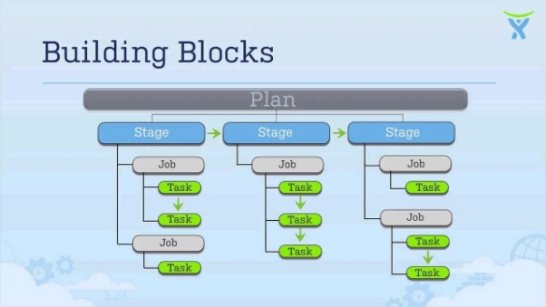
</div>

---

## Requisitos

Para la instalación y el uso de Bamboo es necesario contar con java en el sistema y tener establecida la variable __JAVA_HOME__.

En el caso de la versión 8.0, que es la versión que vamos a usar, podemos usar las versiones 8 y 11, que son las versiones compatibles.

En el caso de no tener java en nuestro sistema debemos actualizar nuestro sistema de paquetes e instalarlo usando:

```console
sudo apt update
```

```console
sudo apt install openjdk-11-jdk
```

Podemos comprobarlo usando:

```console
java -version
```

<div align="center">
    
</div>

Ahora para establecer la variable JAVA_HOME tendremos que editar /etc/profile:

```console
sudo nano /etc/profile
```

Y escribir al final:

```
export JAVA_HOME=/usr/lib/jvm/java-11-openjdk-amd64
export PATH=$PATH:$JAVA_HOME/bin
```

Por último guardaremos los cambios y haremos:

```console
source /etc/profile
```

Solo faltaría reiniciar el sistema y ya tendríamos declarada la variable de entorno. Para comprobarlo podemos hacer:

```console
echo $JAVA_HOME 
```

<div align="center">
    
</div>

---

## Instalación

Como ya hemos dicho la versión que vamos a usar es la 8.0, siendo la más actual la 8.2.

Lo primero que haremos será crear una carpeta y descargarnos nuestra versión en formato 'tar.gz' con:

```console
mkdir bamboo-installation
cd bamboo-installation/
wget https://www.atlassian.com/software/bamboo/downloads/binary/atlassian-bamboo-8.0.0.tar.gz
```

<div align="center">
    
</div>

Sustituyendo 'atlassian-bamboo-8.0.0.tar.gz' por 'atlassian-bamboo-X.Y.0.tar.gz' siendo X.Y la versión. 

Lo siguiente que haremos será crear un directorio 'home' para nuestra herramienta y descomprimir el archivo descargado.

```console
cd ../
mkdir bamboo-home
cd bamboo-home/
tar -xvf ../bamboo-installation/atlassian-bamboo-8.0.0.tar.gz
```

<div align="center">
    
</div>

Lo siguiente que haremos será establecer la ruta 'home' para nuestro software.

```console
sudo nano atlassian-bamboo-8.0.0/atlassian-bamboo/WEB-INF/classes/bamboo-init.properties
```

<div align="center">
    
</div>

Aquí dentro la pondremos como en el siguiente ejemplo:

```
bamboo.home=/home/rubengonz/bamboo-home/atlassian-bamboo-8.0.0/
```

<div align="center">
    
</div>

Ahora ya podríamos arrancar nuestro servicio usando:

```console
./atlassian-bamboo-8.0.0/bin/start-bamboo.sh
```

Nos debe salir un mensaje similar a:

<div align="center">
    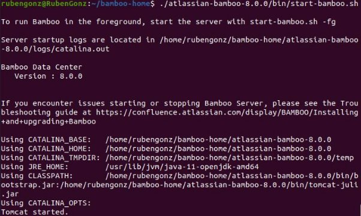
</div>

Donde al acceder al puerto 8085 en nuestro navegador podremos ver:

<div align="center">
    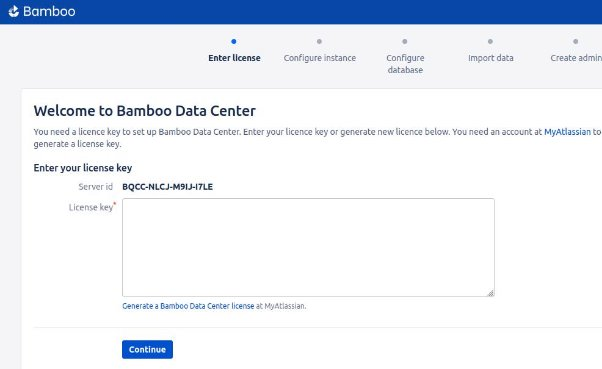
</div>

En el caso de querer parar el servicio podemos usar:

```console
./atlassian-bamboo-8.0.0/bin/stop-bamboo.sh
```

---

## Configuración

Al entrar en la pantalla principal lo primero que nos pedía será una clave de licencia que podemos conseguir gratuitamente por un periodo de 30 días desde la página oficial de Bamboo o desde el enlace bajo el textArea.

Cuando la tengamos la insertamos y le damos a __custom installation__.

<div align="center">
    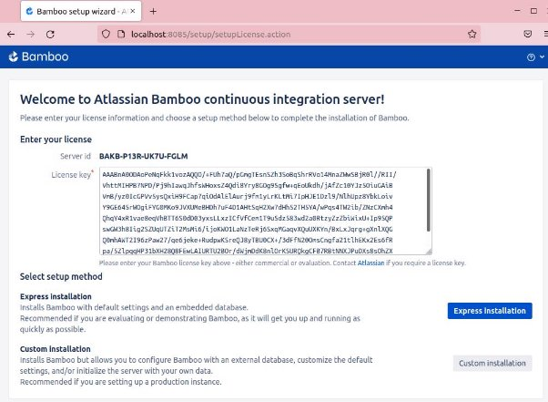
</div>

Esto nos redirigirá a configurar nuestra instancia donde podremos cambiar el puerto, configurar directorios entre otros detalles.

<div align="center">
    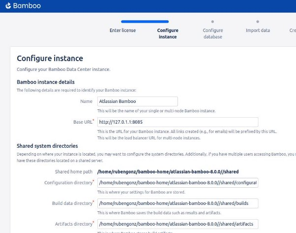
</div>

Lo siguiente que nos saldrá será la configuración de nuestra base de datos donde podremos elegir entre una base de datos externa o poner una embebida que como la H2.

<div align="center">
    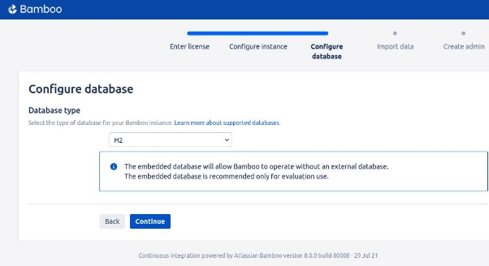
</div>

Nos faltaría uno de los pasos mas importantes que es crear nuestro usuario admin como en el ejemplo:

<div align="center">
    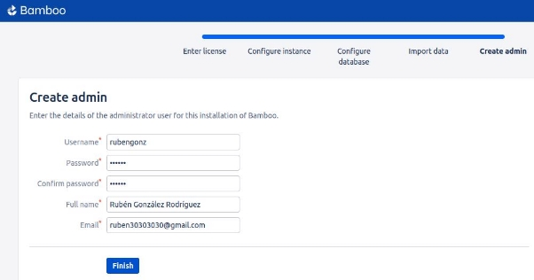
</div>

Ahora ya tendríamos acceso al Home de Bamboo.

<div align="center">
    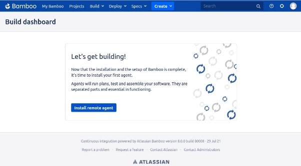
</div>

---

## Creación de un proyecto en Git

Para la demostración de como hacer tasks en Bamboo lo que haremos será hacer uso de un repositorio de Git, (aunque no es necesario) donde tendremos nuestro despliegue. Este tendrá la siguiente estructura:

<div align="center">
    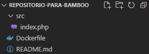
</div>

Donde tenemos un fichero index.php con contenido html:

<div align="center">
    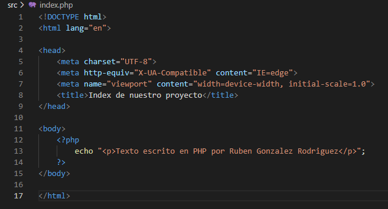
</div>

Un dockerFile que será el que nos ayudará a desplegar:

<div align="center">
    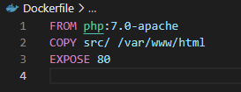
</div>

---

## Creación de un agente

Para empezar a trabajar con Bamboo tendremos que hacer uso de un agente. Un __'agente'__ es un servicio que ofrece capacidades para compilar pudiendo ser remoto o local. En nuestro caso vamos a hacer uso de uno local ya que es más fácil de configurar y Bamboo no tiene restricciones con ellos, opuestamente a los agentes remotos.

Para ello nos dirigiremos a la configuración:

<div align="center">
    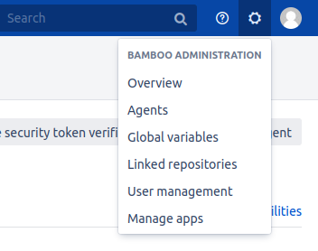
</div>

Elegiremos crear un nuevo agente local:

<div align="center">
    
</div>

Establecer su nombre y una breve descripción:

<div align="center">
    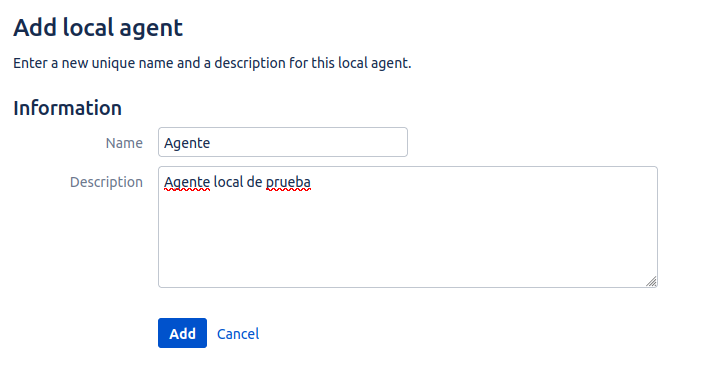
</div>

Y ya tendríamos nuestro agente creado.

---

## Creación de un plan

Lo primero para poder crear un plan será dirigirnos a __'Create'__ desde la barra superior y crearemos un nuevo plan. Esto nos dirigirá a una pantalla como la siguiente:

<div align="center">
    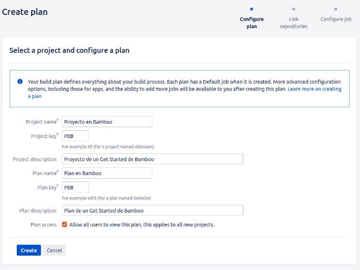
</div>

Aquí rellenaremos el nombre que queremos que tenga nuestro proyecto y el nombre de nuestro plan que será aquel que veremos y ejecutaremos a la hora de la verdad.

Lo siguiente será indicar si queremos que se ejecute localmente o sobre un repositorio. En nuestro caso lo haremos sobre el repositorio que creamos anteriormente alojado en GitHub.

<div align="center">
    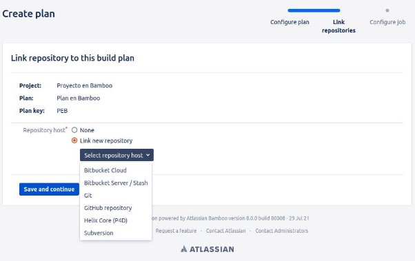
</div>

Deberemos poner la información necesaria para que Bamboo pueda hacer uso de la información de nuestro repositorio como el token o el mismo nombre.

<div align="center">
    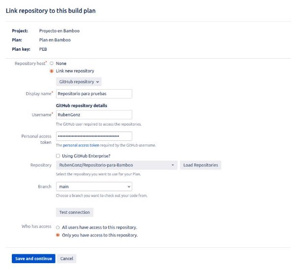
</div>

Lo siguiente que haremos será crear un trabajo. Por defecto nos saldrá esta ventana:

<div align="center">
    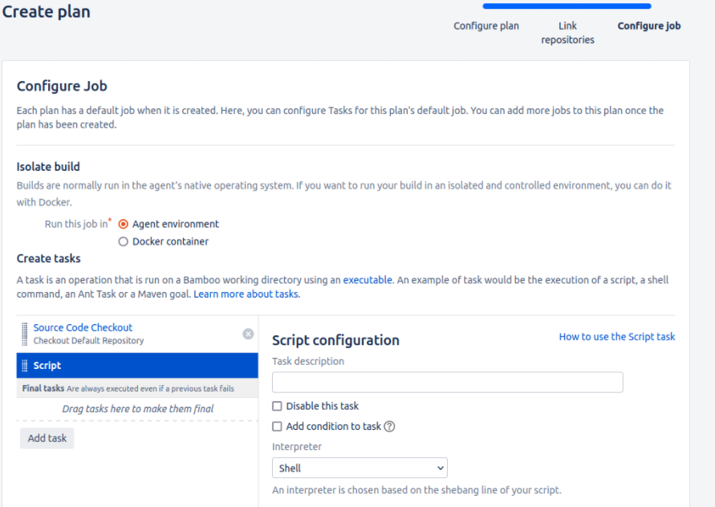
</div>

Aquí decidiremos que agente usaremos, si lo queremos alojar con contenedores Docker, las tareas que tendrá...

Una vez creado a nuestro gusto podremos acceder a él y establecer un nombre más adecuado como por ejemplo:

<div align="center">
    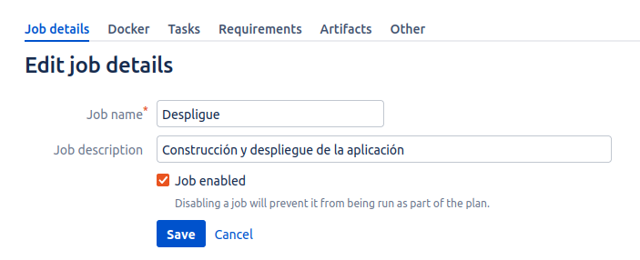
</div>

Crearemos tantos como necesitemos. En nuestro caso solo haremos uso de un único Job por comodidad.

---

## Crear tareas

Dentro de este Job podremos crear tantas tareas como veamos necesarias. En mi caso crearé dos tareas una para construir y arrancar una imagen de docker y otra para comprobar el contenido de la página. Las tareas las crearemos desde el botón 'Add Task':

<div align="center">
    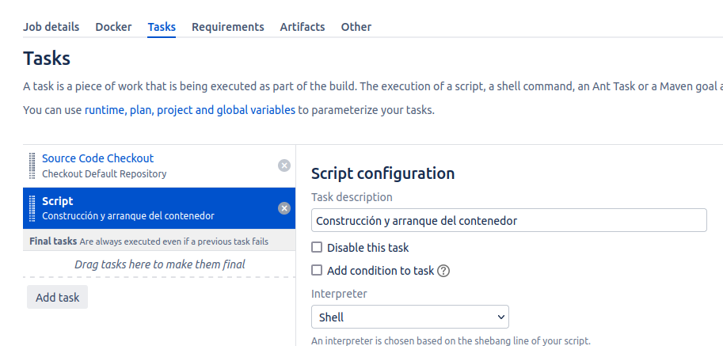
</div>

Aquí nos abrirá una ventana con todas las opciones de tareas que tienes disponibles como, por ejemplo, shell, npm o Junit.

<div align="center">
    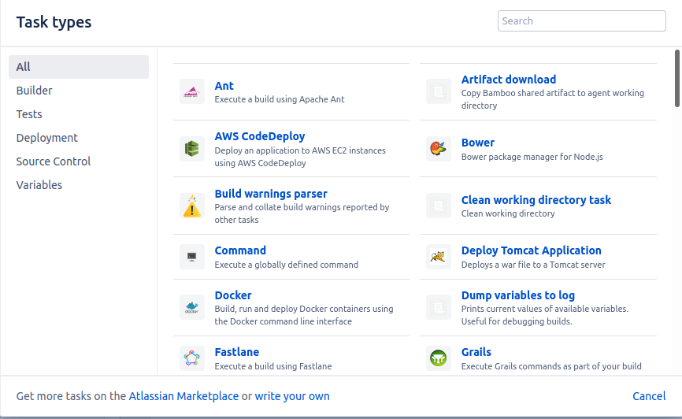
</div>

En nuestro caso usaremos shell/script. Lo que nos dejará esta visión:

<div align="center">
    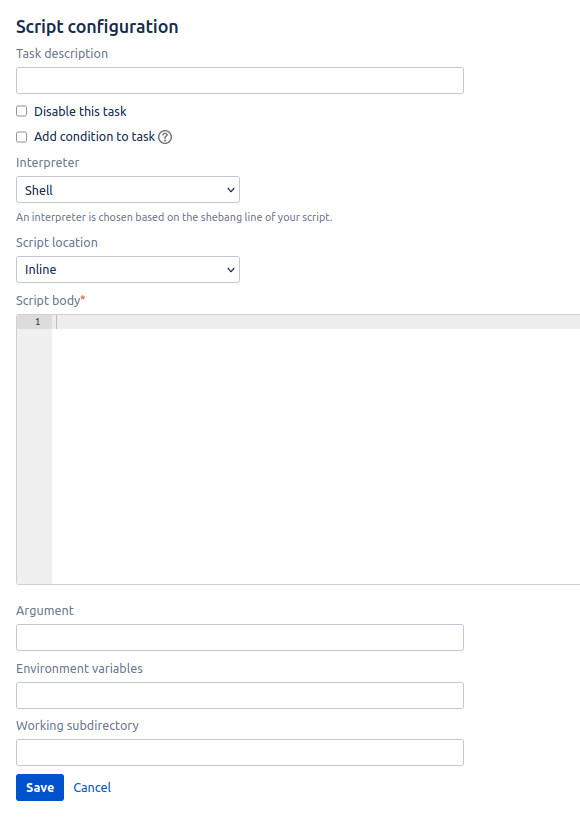
</div>

Aquí podremos ver como nos permite añadirle una descripción, identificar el intérprete (shell,powershell,cmd...) e indicar donde se encuentra el archivo de la task donde podemos escribirla en un cuadro de texto o extraerla de un archivo del repositorio. En nuestro caso hemos elegido la primera opción por lo que nos quedarían:

- Construcción y arranque del contenedor

<div align="center">
    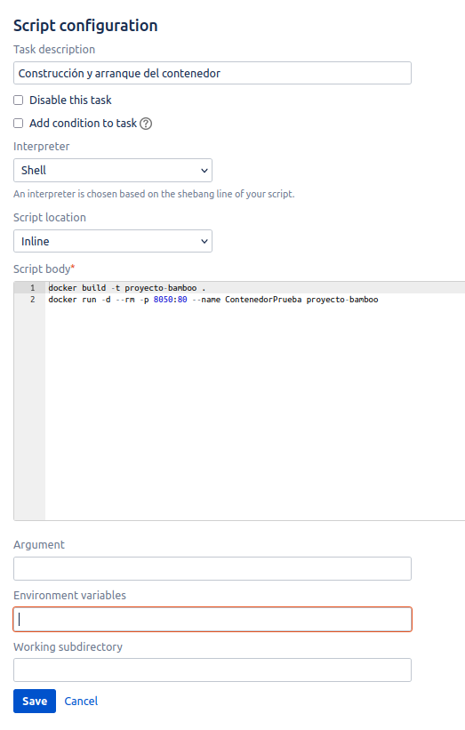
</div>

- Comprobación del contenido

<div align="center">
    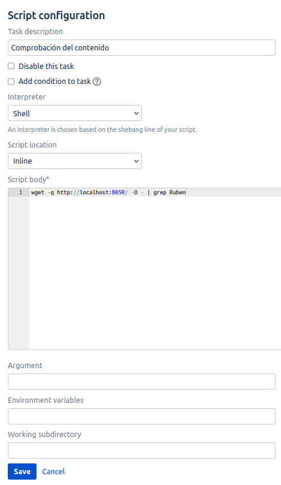
</div>

---

## Ejecución de un plan

Para ejecutar un plan debemos dirigirnos al home de nuestro plan y dirigirnos al lado derecho y clickar en 'Run'.

<div align="center">
    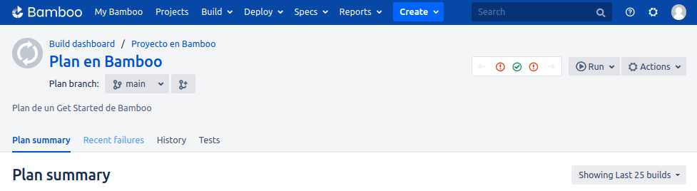
</div>

Esto nos redirigirá a una pantalla donde veríamos como procede la ejecución dándonos detalles del tiempo restante estimado y comparaciones con ejecuciones anteriores entre otras cosas.

<div align="center">
    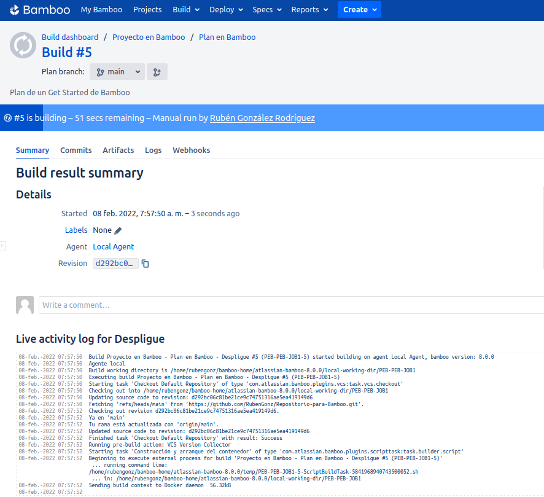
</div>

Cuando el proceso esperase deberíamos obtener un mensaje similar a :

<div align="center">
    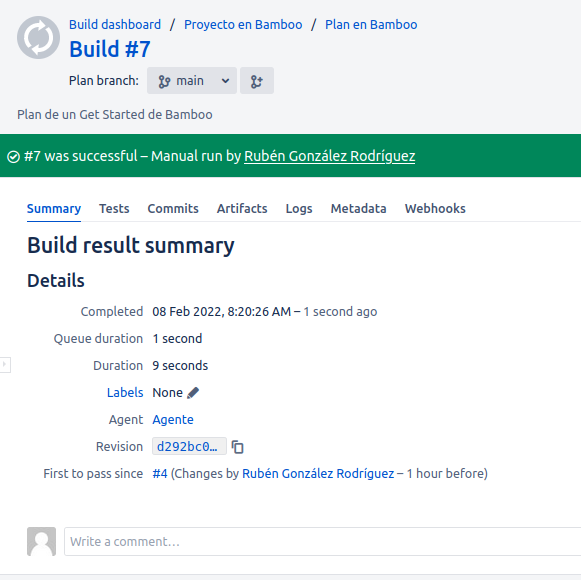
</div>

Con esto ya sabremos que hemos hecho nuestro despliegue correctamente.

Para poder ver el plano general de nuestro plan podriamos ir a su home donde veríamos las ejecuciones hechas, los porcentajes de fallo, el tiempo transcurrido...

<div align="center">
    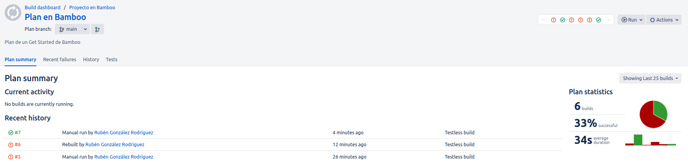
</div>

---

## Conclusión

La herramienta es compleja de entender en el caso de que no tengas conocimientos básicos anteriormente, sin embargo se puede ver todo el potencial que tiene sin tener que indagar demasiado en el servicio. El software está adaptado para poder interactuar con muchas otras herramientas sin tener que contar con difíciles instalaciones por lo que ayuda a que sea más cómoda para el usuario y por lo tanto facilite el trabajo que en otras herramientas no sería tan sencillo.