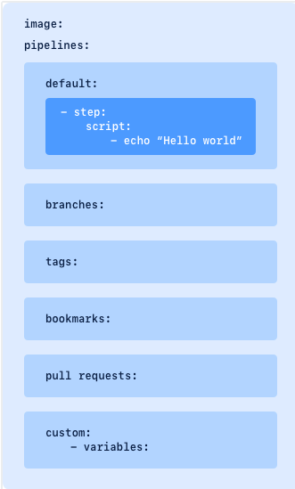
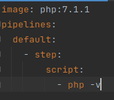
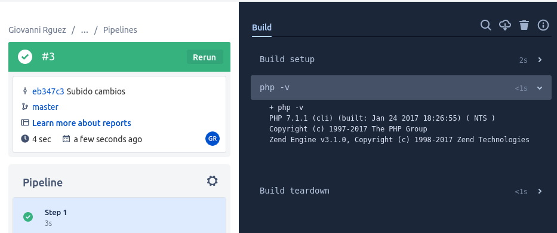

# **Bitbucket Pipelines**

## **Índice**
[Portada](#id1) 
[Índice](#id2) 
[Introducción](#id3) 
[Herramientas con las que se relaciona](#id4) 
[Definición de un Pipeline](#id5) 
[Ejemplo de un Pipeline](#id6) 
[Conclusión](#id7) 

## **Introducción**
BitBucket es una herramienta de alojamiento de código
y colaboración basada en Git para equipos. Se puede integrar
con Jira, Bitbucket pretende que crees código de calidad mediante
pruebas automatizadas e implementación de código.

## **Herramientas con las que se relaciona**
BitBucket puede relacionarse con herramientas como Jira, que es un
gestor de proyectos, funciona también con git para la utilización de
repositorios como por ejemplo GitHub.

## **Definición de un Pipeline**
Para definir un Pipeline en BitBucket necesitaremos definir lo siguiente:

- La imagen de Docker que usaremos (si la necesitamos).
- Luego tendremos que escribir **pipelines:**
- Dentro de **pipelines** definimos **default:**
- En este punto definimos los pasos que hará nuestro Pipeline.
- En este punto definimos **script:** con los comandos que queramos lanzar.
- Podemos elegir en que **branch** queremos que se lance.
- Elegiremos etiquetas específicas de Git si lo deseamos y/o necesitamos.
- También podremos seleccionar un bookmark para una compilación específica.
- Por último podemos seleccionar la rama de destino antes de la ejecución.

## **Ejemplo de un Pipeline**
Este ejemplo será lanzar una imagen de PHP y verificar la versión de PHP, el Pipeline
es el siguiente:

El siguiente paso será subirlo al repositorio y lanzarlo, como vemos, el resultado es correcto.

