# BUDDY (CI/CD)

## Indice

- 1. [¿Que es?](#id1)
- 2. [Utilización de pipelines](#id2)
- 3. [Comenzando con Buddy](#id3)
   - 3.1 [Creamos una cuenta](#id3_1)
   - 3.2 [Enlazamos con un proyecto existente](#id3_2)
   - 3.3 [Pipelines mediante la GUI](#id3_3)
   - 3.4 [Añadimos acciones a la pipeline](#id3_4)
   - 3.5 [Arrancamos el pipeline](#id3_5)
   - 3.6 [Pipelines mediante YML](#id3_6)
- 4. [Planes de pago](#id4)
- 5. [Buddy vs Circle CI](#id5)
- 6. [Buddy vs GitLab CI](#id6)
- 7. [Buddy vs Jenkins](#id7)
- 8. [Conclusión](#id8)


## 1. ¿Que es? <a name="id1"></a>

Buddy es una herramienta web de integración y despliegue continuo, esta se integra con las principales plataformas usadas el desarrollo de software (GitHub, AWS, Docker, etc) y con múltiples lenguajes (JavaScript, PHP, Python, Ruby, Java, Go, etc).

Su principal elemento diferenciador frente a los competidores es que promete permitirnos hacer las pipelines desde una interfaz web sencilla y fácil de utilizar, evitandonos asi tener que realizar ficheros .yml, aunque también se nos permite utilizarlos.


## 2. Utilización de pipelines <a name="id2"></a>

Buddy ofrece la posibilidad de diseñar el despliegue continuo mediante pipelines personalizadas que confirmen que todo ha ido correctamente:


Estos pipelines nos ayudarán a cosas como:

- Testear que la aplicación funciona correctamente antes de subir los cambios a la rama correspondiente.
- Testear que los envíos a un servidor reciben una respuesta correcta.
- Notificarnos en caso de fallos o incidencias.


## 3. Comenzando con Buddy <a name="id3"></a>

### 3.1 Creamos una cuenta <a name="id3_1"></a>

Primero debemos crearnos una cuenta desde supáginaprincipal, tienen distintos planes de pago (de los que hablaremos más adelante), nosotros nos decantamos por el gratuito para este tutorial.

La cuenta la podemos crear con un email de empresa o iniciando sesión en GitHub, GitLab o BitBucket.

Esta es la página de inicio que nos recibirá:

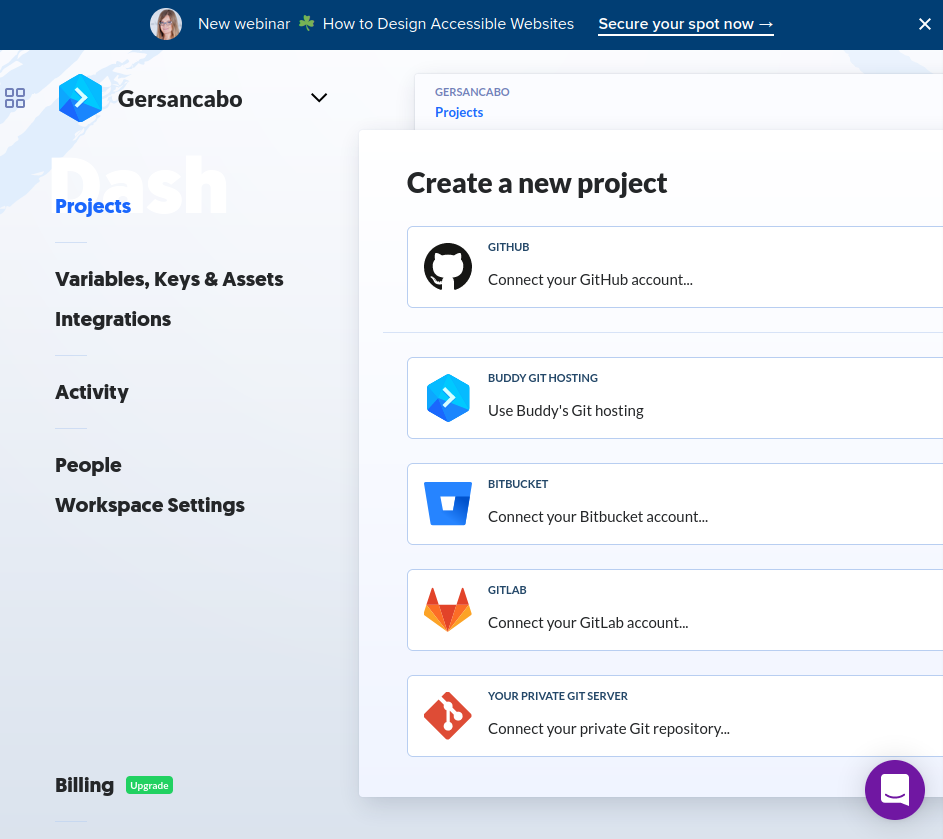


### 3.2 Enlazamos con un proyecto existente <a name="id3_2"></a>

Para ello conectaremos con nuestra cuenta de Github y elegiremos el proyecto que nos interese testear.

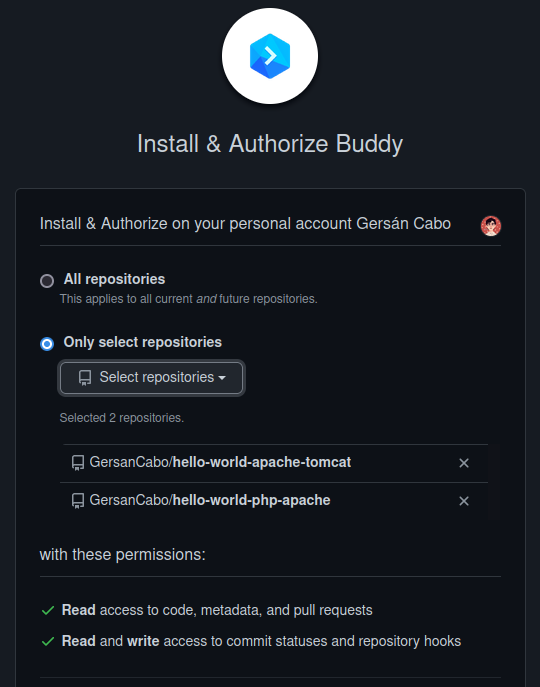

Podemos también dar permiso a Buddy para acceder a todos nuestros repositorios, esto ya depende de nuestro parecer y podremos modificarlo cuando deseemos desde nuestra configuración de GitHub.


Después de darle permisos, nos aparecerá esta pantalla:

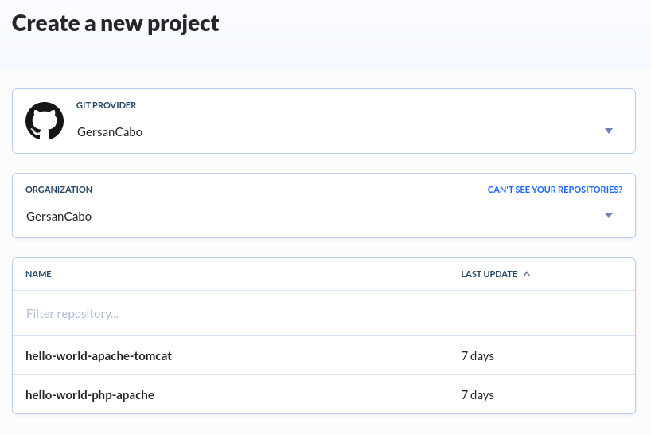

Una vez seleccionado ya podremos empezar a añadir pipelines:

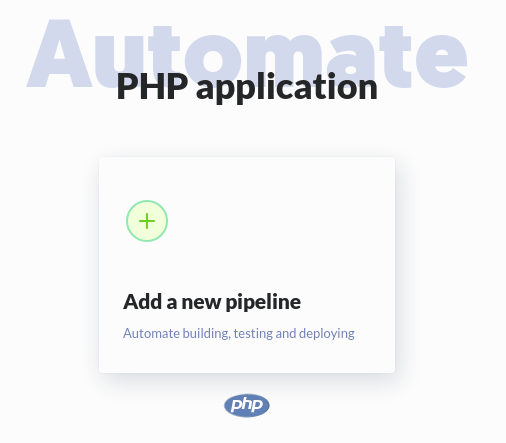


### 3.3 Pipelines mediante la GUI <a name="id3_3"></a>

Esta será la página de configuración de la pipeline:

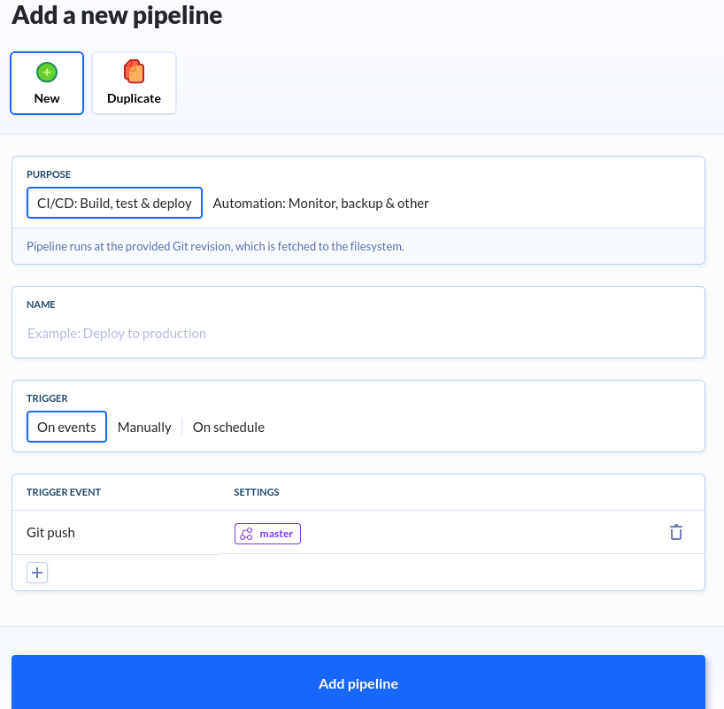

Ahora empezare a definir cada uno de los apartados que podemos configurar:

**- Nueva o duplicada**

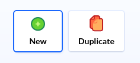

Podemos crear la pipeline desde cero o duplicar ya una existente en otro proyecto

**- Proposito**

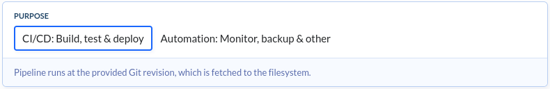

Nuestra pipeline puede tener dos propósitos:

- Para integración y despliegue continuo.
- Para automatizar diversos procesos ajenos a lo primero.

**- Nombre**

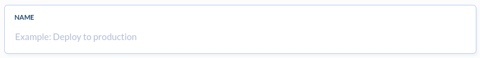

Este apartado no tiene mucho misterio, será el nombre de nuestra pipeline y debe definir lo que hace la misma

**- Disparador**


Los triggers que activen la pipeline pueden ser los tres siguientes

- Eventos: Estos los podemos definir, uno utilizado frecuentemente cuando nuestro proyecto utiliza un repositorio de GitHub es el ‘git push’ de un usuario hacia una rama.
- Manual: El pipeline debe ser activado manualmente.
- Intervalos de tiempo: El pipeline se realizará cada cierto tiempo, podremos definir la franja que nos interese.

A partir de aquí cada trigger tiene su propia configuración, la que nosotros utilizaremos y, quizás la más interesante, es el trigger mediante evento.


### 3.4 Añadimos acciones a la pipeline <a name="id3_4"></a>

Ahora tendremos que decidir las acciones que queremos realizar entre todas las que nos ofrece Buddy.

Estas se dividen en categorías y Buddy nos sugiere algunas según los archivos que detecte en nuestro proyecto.

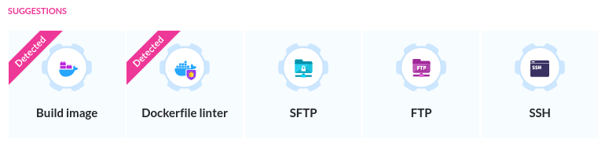

Algunas categorías interesantes son:

**- Setup**
    Aquí encontraremos diversas acciones que afectarán al propio uso de la pipeline y al
    propio proceso de CI/CD que nos ofrece Buddy. Podríamos decir que son acciones
    que afectan más al trabajo de las pipelines que al propio proyecto.

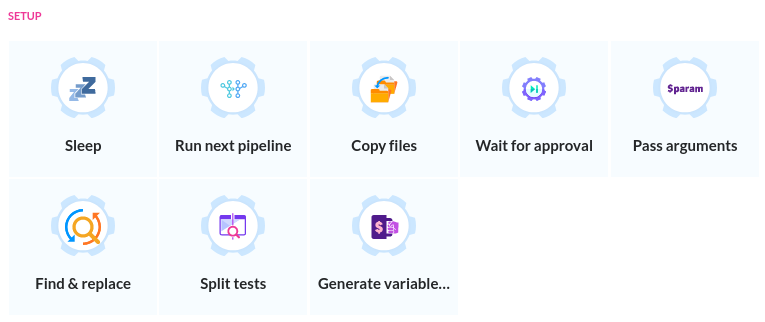

**- Transfer**
    Nos puede interesar transferir el propio proyecto a un servidor tras finalizar los
    pipelines de comprobación, transferir archivos hacia otra máquina, etc. Para ello
    están las siguientes acciones que hacen uso de la tecnología FTP y derivados.


**- DevOps**
    En el ciclo de vida del desarrollo de software encontramos muchas tareas repetitivas
    que ralentizan nuestro trabajo, mediante estas acciones podremos automatizarlas,
    liberarnos de esa carga y agilizar el tiempo.

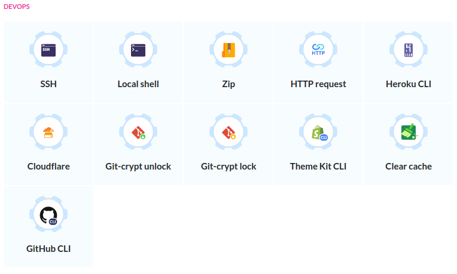

**- Run commands in dedicated environment**
    Está es la categoría que cuenta con más acciones, ya que tenemos para decidir
    entre múltiples entornos (imagenes de Docker) con una serie de herramientas
    preinstaladas, además podremos utilizar otra imagen de Docker ajena a las que nos
    recomienda Buddy

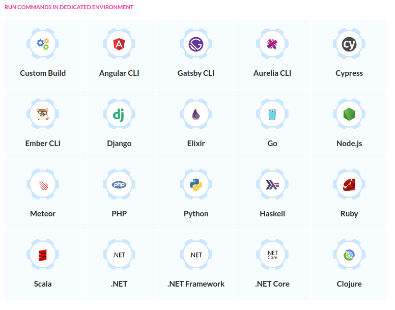

**- Docker y Kubernetes**
    Utilizar Docker en nuestros proyectos es algo del día a día, con lo que no podían
    faltar esta serie de acciones para trabajar con contenedores e imágenes.

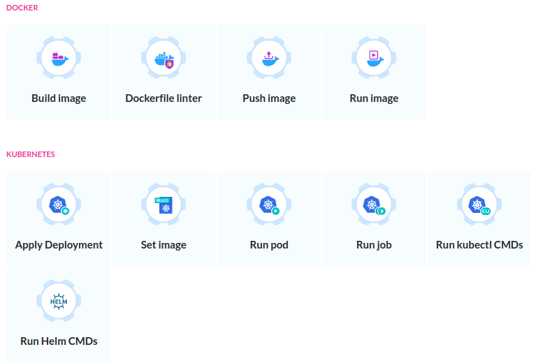

**- Notifications**
    Conocer el resultado de nuestras pipelines o estar al tanto del monitoreo de nuestra
    aplicación resulta indispensable, para esto contamos con esta serie de acciones que
    utilizan herramientas de mensajería que nos son conocidas.

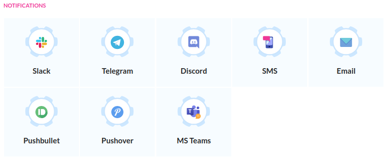


Cada acción tiene sus propias opciones y configuración, además podremos crear las nuestras propias o editar los comandos que realizan cada una, con lo que enseñarlas alargaría este documento más de lo esperado, así que invito al lector a verlas por sí mismo y toquetear un poco la herramienta.

En nuestro caso, haremos un pipeline sencillo que consistiría en construir la imagen de Docker y arrancarla.

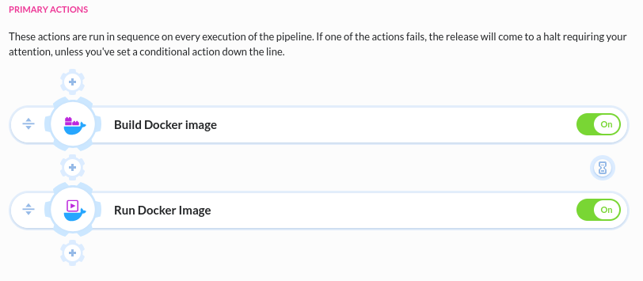

### 3.5 Arrancamos el pipeline <a name="id3_5"></a>

Le damos al botón Run y nos aparecerá lo siguiente:

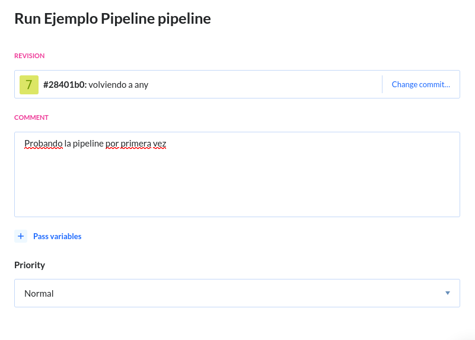

Ponemos un comentario descriptivo como el de la captura y arrancamos.


A medida que se van realizando las acciones se nos mostrará el resultado de las ya
terminadas, además tendremos acceso sencillo a los logs de las mismas.

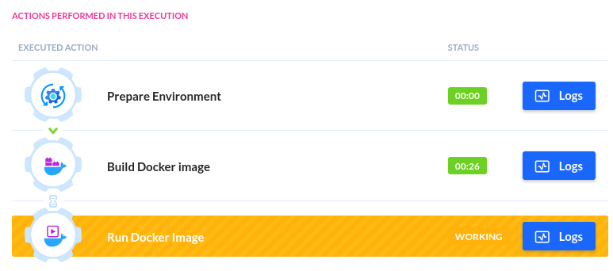

Dependiendo de nuestro plan de pago las acciones tardarán más o menos y tendremos cola
si el tráfico de Buddy en ese momento es muy alto.

### 3.6 Pipelines mediante YML <a name="id3_6"></a>

Para cambiar de modo GUI a modo YML uno de nuestros proyectos debemos tocar la
siguiente configuración:

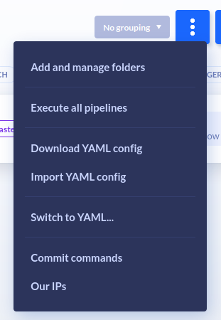

Al tocar en “Switch to YAML...” nos aparecerá un menú de configuración, en el cual
debemos seleccionar lo siguiente:

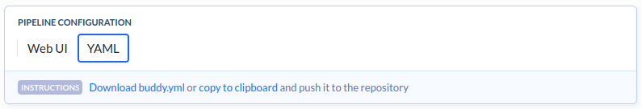

Y nuestro proyecto pasará a modo YAML y buscara pipelines declaradas en el archivo
buddy.yml de nuestro repositorio, un ejemplo de uno seria este:

```
- pipeline: "Java example"
on: "EVENT"
events:
- type: "PUSH"
    refs:
    - "refs/heads/master"
priority: "NORMAL"
fail_on_prepare_env_warning: true
actions:
- action: "Execute: mvn clean install"
    type: "BUILD"
    working_directory: "/buddy/presentacion-buddy-java"
    docker_image_name: "library/maven"
    docker_image_tag: "3.3.3"
    execute_commands:
    - "mvn clean install"
    - "mvn clean test"
    cached_dirs:
    - "/root/.m2/repository"
    volume_mappings:
    - "/:/buddy/presentacion-buddy-java"
    cache_base_image: true
    shell: "BASH"
```

Algunas etiquetas relevantes son:

- ‘on’ y ‘events’: Donde declararemos el evento, su disparador y la rama que hara
    activar este disparador (en caso de que nuestro disparador se active con un cambio
    en el repositorio).
- ‘priority’: Con los distintos planes de pago de Buddy podremos tener en proceso 1 o
    2 pipelines a la vez, por lo que con esta opción podremos elegir las pipelines a las
    que damos más importancia y prefiramos que se ejecuten primero.
- ‘actions’: En esta etiqueta se detalla la acción a realizar en sí, declaramos el nombre
    de esta etapa de acciones (“Build”, “Develop”, “Test”, etc), los directorios donde
    trabajaremos, la imagen de docker que usaremos, los comandos a ejecutar, la shell
    que utilizara Buddy, etc.


## 4. Planes de pago <a name="id4"></a>

Contamos con 4 planes de pago:

- Free (0$/mes):
    - Hasta 5 proyectos
    - Hasta 120 pipelines
    - 512Mb de cache
    - 1Gb de RAM
    - 2 nucleos de CPU
    - 1 pipeline a la vez
    - 1 acción paralela a la vez
- Pro (75$/mes):
    - Hasta 20 proyectos
    - Pipelines ilimitadas
    - 10Gb de cache
    - 3Gb de RAM
    - 2 nucleos de CPU
    - 1 pipeline a la vez
    - 1 acción paralela a la vez
- Hyper (200$/mes):
    - Proyectos ilimitados
    - Pipelines ilimitadas
    - 20Gb de cache
    - 3Gb de RAM
    - 2 nucleos de CPU
    - 2 pipeline a la vez
    - 1 acción paralela a la vez
- On-premises (35$/mes por usuario):
    Todas las características del plan Hyper más:
       - Recursos customizados
       - Soporte empresarial
       - LDAP
       - Active Directory
       - Integración con GitHub EE y GitLab autogestionada


## 5. Buddy vs Circle CI <a name="id5"></a>

<table>
    <thead>
        <tr>
            <th>
                FEATURES
            </th>
            <th>
                Buddy
            </th>
            <th>
                CircleCI
            </th>
        </tr>
    </thead>
    <tbody>
        <tr>
            <td>Configuración del GUI</td>
            <td style="color: green">Sí</td>
            <td style="color: red">No</td>
        </tr>
        <tr>
            <td>Configuración del YAML</td>
            <td style="color: green">Sí</td>
            <td style="color: green">Sí</td>
        </tr>
        <tr>
            <td>Cloud</td>
            <td style="color: green">Sí</td>
            <td style="color: green">Sí</td>
        </tr>
        <tr>
            <td>Soporte técnico</td>
            <td style="color: green">Sí</td>
            <td>De pago</td>
        </tr>
        <tr>
            <td>Compatibilidad con Docker</td>
            <td style="color: green">Sí</td>
            <td>De pago</td>
        </tr>
        <tr>
            <td>Entorno macOS</td>
            <td style="color: green">Sí</td>
            <td>De pago</td>
        </tr>
        <tr>
            <td>Sistemas de pago</td>
            <td>
                <p>Free: 0$</p>
                <p>Pro: 75$</p>
                <p>Hyper: 200$</p>
                <p>On-premises: 35$/user</p>
            </td>
            <td>
                <p>Free: 0$</p>
                <p>Performance: 15$</p>
                <p>Scale: 2000$</p>
                <p>Custom: ¿$?</p>
            </td>
        </tr>
    </tbody>
</table>


## 6. Buddy vs GitLab CI <a name="id6"></a>

<table>
    <thead>
        <tr>
            <th>
                FEATURES
            </th>
            <th>
                Buddy
            </th>
            <th>
                GitLab CI
            </th>
        </tr>
    </thead>
    <tbody>
        <tr>
            <td>Configuración del GUI</td>
            <td style="color: green">Sí</td>
            <td style="color: red">No</td>
        </tr>
        <tr>
            <td>Configuración del YAML</td>
            <td style="color: green">Sí</td>
            <td style="color: green">Sí</td>
        </tr>
        <tr>
            <td>Cloud</td>
            <td style="color: green">Sí</td>
            <td style="color: green">Sí</td>
        </tr>
        <tr>
            <td>Soporte técnico</td>
            <td style="color: green">Sí</td>
            <td>De pago</td>
        </tr>
        <tr>
            <td>Compatibilidad con Docker</td>
            <td style="color: green">Sí</td>
            <td style="color: green">Sí</td>
        </tr>
        <tr>
            <td>Entorno macOS</td>
            <td style="color: green">Sí</td>
            <td style="color: green">Sí</td>
        </tr>
        <tr>
            <td>Sistemas de pago</td>
            <td>
                <p>Free: 0$</p>
                <p>Pro: 75$</p>
                <p>Hyper: 200$</p>
                <p>On-premises: 35$/user</p>
            </td>
            <td>
                <p>Free: 0$</p>
                <p>Premium: 19$</p>
                <p>Ultimate: 99$</p>
                <p>Custom: 10$-60$</p>
            </td>
        </tr>
    </tbody>
</table>


## 7. Buddy vs Jenkins <a name="id7"></a>

<table>
    <thead>
        <tr>
            <th>
                FEATURES
            </th>
            <th>
                Buddy
            </th>
            <th>
                GitLab CI
            </th>
        </tr>
    </thead>
    <tbody>
        <tr>
            <td>Configuración del GUI</td>
            <td style="color: green">Sí</td>
            <td style="color: green">Sí</td>
        </tr>
        <tr>
            <td>Configuración del YAML</td>
            <td style="color: green">Sí</td>
            <td style="color: green">Plugin</td>
        </tr>
        <tr>
            <td>Cloud</td>
            <td style="color: green">Sí</td>
            <td style="color: red">No</td>
        </tr>
        <tr>
            <td>Soporte técnico</td>
            <td style="color: green">Sí</td>
            <td style="color: red">No</td>
        </tr>
        <tr>
            <td>Compatibilidad con Docker</td>
            <td style="color: green">Sí</td>
            <td style="color: green">Sí</td>
        </tr>
        <tr>
            <td>Selección de entorno</td>
            <td style="color: green">Sí</td>
            <td style="color: red">No</td>
        </tr>
        <tr>
            <td>Sistemas de pago</td>
            <td>
                Planes de pagp
            </td>
            <td>
                Totalmente gratuito
            </td>
        </tr>
    </tbody>
</table>


## 8. Conclusión <a name="id8"></a>

Buddy es una herramienta interesante con una curva de aprendizaje bastante ligera y que nos permite hacer pipelines de una manera muy cómoda, a su vez, la poca importancia que le dan en la documentación a la declaración de una pipeline de forma sintáctica y el énfasis que hacen en la utilización de la GUI, puede llevar a que nos resulte problemático trabajar sin ella o encontrar información sobre un posible fallo en las pipelines creada mediante .yml.

Por otro lado, los tests se realizan en los servidores de Buddy, esto nos evita tener que consumir recursos propios y cargar de trabajo nuestros servidores pero, por otro lado, depender de la infraestructura de Buddy para estos test puede resultar problemático para algunos proyectos y empresas.

Para finalizar, el precio de su versión Pro y las características que nos ofrecen quizás resultan poco competitivas respecto a otros competidores, aunque su facilidad, el soporte técnico y la gran variedad en las plantillas de acciones que ofrecen son un gran factor diferenciador a tener en cuenta.


##### Autor: <a href="https://github.com/GersanCabo">Gersán Cabo</a>


##### Pagina Buddy: <a href="https://buddy.works/">https://buddy.works/</a>