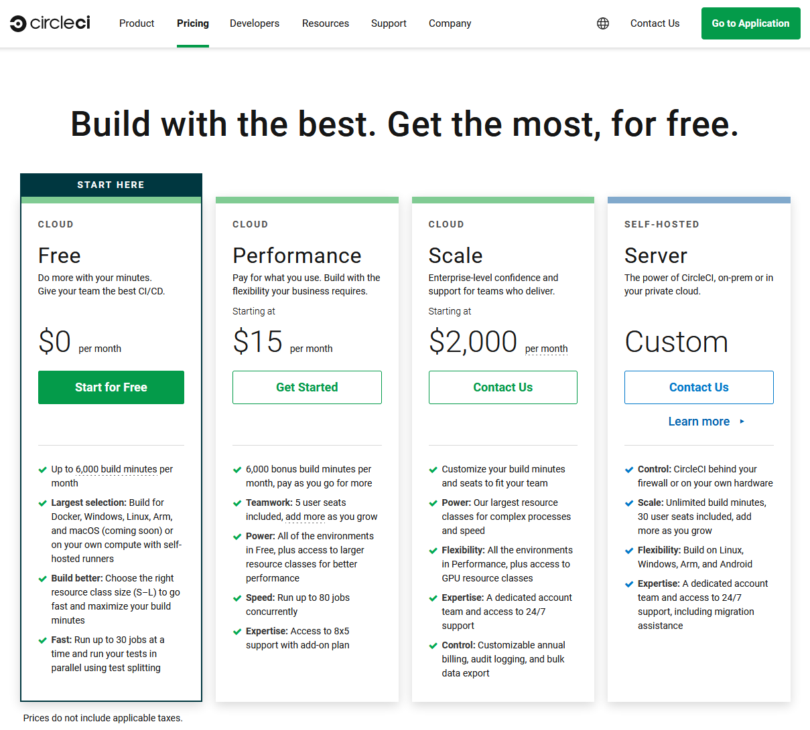
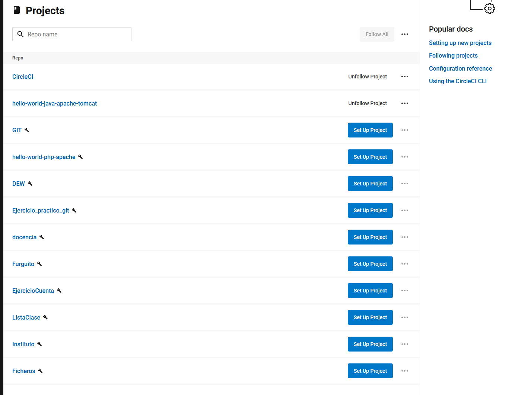
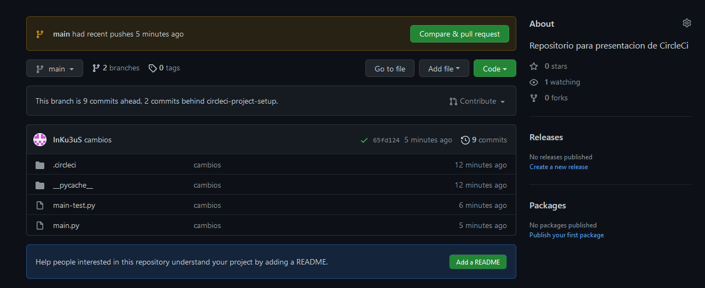
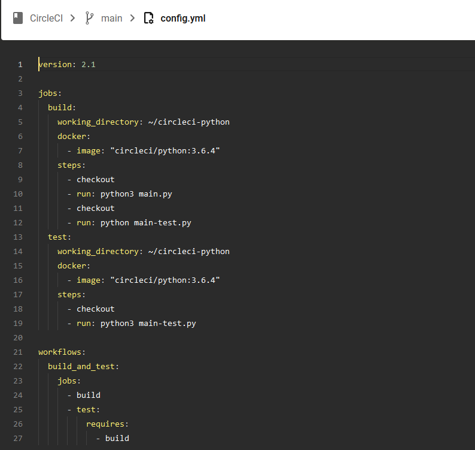
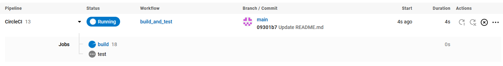
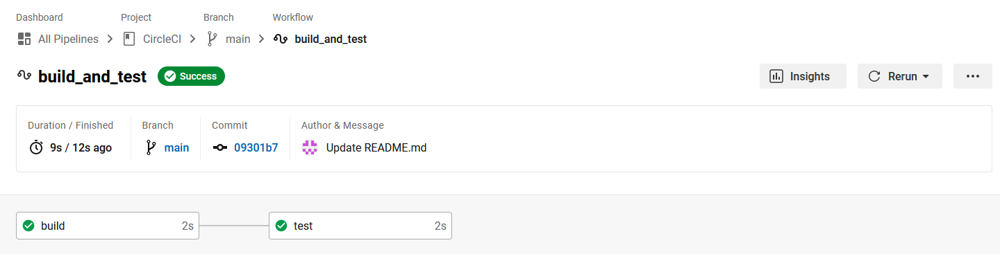
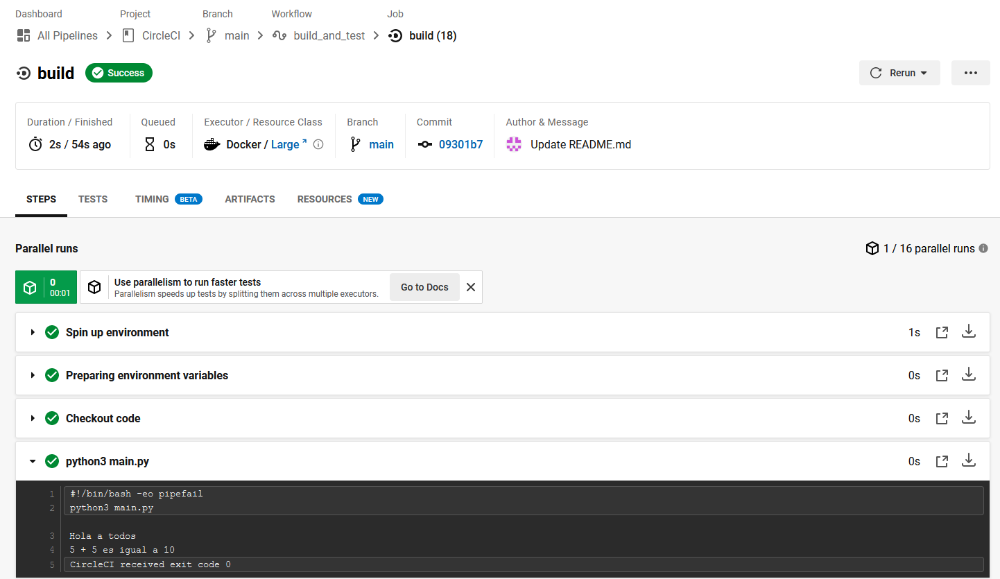
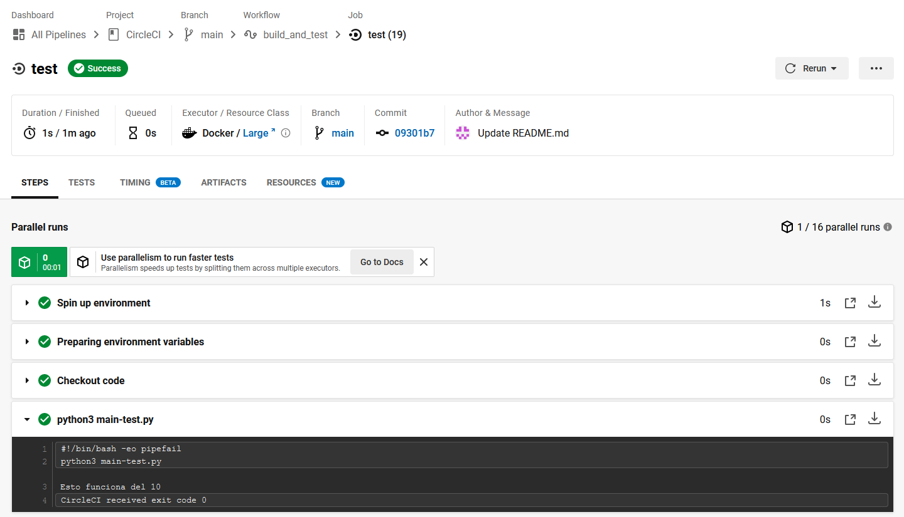
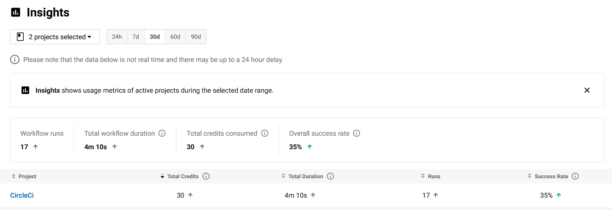

## **CircleCI**

**Neftalí Rodríguez Rodríguez**

[**Github**](https://github.com/InKu3uS/)

Indice

[CircleCI](#id1)

[2. Parte 1](#id1)

[2. Parte 2](#id2)

[3. Parte 3](#id3)

[4. Parte 4](#id4)

[5. Parte 5](#id5)

[6. Parte 6](#id6)

[7. Parte 7](#id7)

[8. Parte 8](#id8)

[9. Parte 9](#id9)

## **2. Parte 1**

**CircleCI** es una de las plataformas de integración continua y despliegue continuo **(CI/CD)**
más grandes del mundo. Procesar más de **1 millón de desarrollos por día**.

Empresas como **Spotify, Coinbase, Stitch Fix y BuzzFeed** utilizan esta solución para mejorar la productividad del equipo
de ingeniería, lanzar mejores productos y salir al mercado más rápido.

## **2. Parte 2**

En su versión básica, CircleCI es gratuito.

La cuenta gratuita nos permitirá trabajar con contenedores de **DockerHub** o del propio
repositorio de CircleCI y ejecutar hasta 30 tareas por proyecto.

Dispone de dos cuentas de pago **"Performance"** y **"Scale"** que añaden más tiempo de uso,
mayor potencia de procesado, grupos de trabajo y asistencia 24/7.

Además puedes modificar tu cuenta gratuita para añadir solo lo que necesites y pagar
solo por lo que vas a usar.

## **3. Parte 3**

Al acceder a CircleCI por primera vez nos pedirá crear una cuenta o acceder con GitHub.

Al loguearnos, nos pedirá que le indiquemos que repositorio vamos a usar. 
Una vez lo hayamos elegido nos creará un ejemplo de **Hello World** y lo ejecutará. 
Como se ve en la imagen a continuación. 

## **4. Parte 4**

También podremos añadir otros repositorios si nos dirigimos al menú **"Projects"** 

## **5. Parte 5**

Si clicamos sobre el proyecto y luego en **"Project Settings"** podremos añadir Triggers para que se ejecute a determinadas horas,
o bajo determinadas circunstancias, crear variables de entorno propias para usar dentro del proyecto, administrar las 
notificaciones que vamos a recibir al desplegar el proyecto o incluso crear 
"Badges" para añadir a páginas web o a documentos en Markdown que nos indican en tiempo real el estado de el último despliegue. 
Como este : 

## **6. Parte 6**

Para este caso, he usado una aplicación muy sencilla en **Python.** Que contiene una función que recibe dos números y los suma, y un otra función que llama a la anterior y realiza la suma de 5+5

Y también un test que comprueba que el resultado de sumar los números 2 y 3 sea igual a 5.

Y subimos los cambios al repositorio de **GitHub.**

## **7. Parte 7**

Una vez hayamos hecho el primer Pull al repositorio. Si nos dirigimos a nuestro proyecto en CircleCI, este nos recomendará
crear un archivo **"config.yml"** para este.

Nos preguntará bajo que lenguaje estamos trabajando y nos creará uno por defecto, el cual después de modificar quedó de esta manera.

## **8. Parte 8**

Una vez terminado de configurar el **"config.yml"** y subidos los cambios a GitHub, CircleCI ejecutará el Pipeline
de manera automática.

Si todos los pasos del Pipeline se han ejecutado de manera correcta veremos una pantalla que nos mostrará los
pasos creados en el Pipeline marcados en verde.

Podremos pulsar sobre cualquiera de los pasos para ver los resultados con más detalle.

Resultados de **"Build"**

Resultados de **"Test"**

## **9. Parte 9**

Por último si vamos a la sección **"Insight"** del proyecto podremos ver los detalles de las ejecuciones, como el
numero de veces que se ha ejecutado, porcentaje de éxito, tiempo total de ejecución, media de ejecuciones por dia,
media de tiempo de ejecución y **"Tickets"** gastados dicho proyecto.

