# GitHub CI/CD Marketplace

## 1. Introducción.
Es cierto que actualmente hay multitud de herramientas para poder automatizar tareas de integración y despliegue continuos, pero ninguna permite tenerlo integrado en tu propios software de repositorio de código. 
Entonces aparece GitHub Actions, con esto podemos realizar todos las tareas de integración y despliegue, como son batería de test, comprobación del código o desplegara nuestra aplicación, todo desde GitHub.

Actions es una herramienta que nos ayuda a reducir los pasos necesarios para la ejecución de código, mediante la creación de un "workflow" encargado del Pipeline. Nos permite crear workflows que se pueden utilizar para compilar, testear y desplegar código.

**¿Como puede hacer esto GitHub?**
Resulta que Actions usa paquetes de códigos en Docker, los cuales se lanzan en los servidores de GitHub que ademas son compatibles con cualquier lenguaje.

## 2. Continuous Integration ( CI ).
**¿Qué es la integración continua?**
"La integración continua es la practica de automatizar los cambios en el código de varios desarrolladores en un único proyecto"
Para implementar la integración continua es Github lo que se hace es crear uno o varios workflows que se lanzan cuando se realiza un "pull request" y si todos las comprobaciones son correctas se mezcla.

## 3. Continuous Deployment ( CD ).
**¿Qué es la implmentación continua?**
"La implementación continua es un proceso que usa pruebas automatizadas para comprobar si los cambios son correctos y estables para la implementación en un entorno de producción"
Para implementar estas tareas en GitHub action realizamos workflow que se lancen una vez realizo un pull request mezclado o se ha realizado un push.

## 4. Sintaxis.
Para realizar un pipelin o como lo denomina GitHub "Workflows" tenemos crear una carpeta en nuestro repositorio ".github" y dentro una carpeta "workflow" con los ficheros **.yml donde tendremos que definir los pasos de la pipeline.

Ejemplo

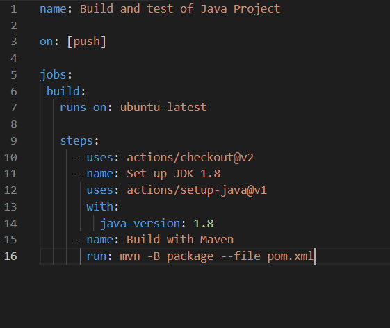

Puntos de sintaxis básica:
- "name": apartado opciones para el nombre de workflows.
- "on": especifica el evento que ejecutara el fichero si quieres especificar rama hacer lo siguiente.
      
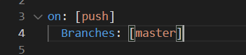
	

- "jobs": aquí se especifican los jobs que pueden ser uno o mas.
- "build": declaración del nombre del primer "jobs" es obligatorio.
- "runs on": configura el workflow para que se ejecute un en una instancia que se especifica, [mas opciones](https://docs.github.com/en/actions/using-workflows/workflow-syntax-for-github-actions#jobsjob_idruns-on).
- "steps": donde se especifica los pasos que se van a realizar que pueden ser uno o varios.
- "name": nombre opcional del paso.
- "use": aquí descarga e instalar un versión especifica que la comunidad de github a preparado.
- "run": esta palabra le dice al job que es lo que tiene que ejecutar en este caso se lanza maven.

## 5. Ejemplo.
Ahora se va ver un ejemplo de Workflow de un "Hello World!!" muy básico.

Primero de todos creamos un nuevo repositorio en nuestro Github y creamos los siguiente estructura. El README  y LICENSE son opciones.

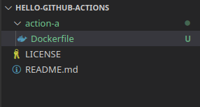

Ademas en nuestro caso esto se ha realizando en otra rama que hemos llamado .

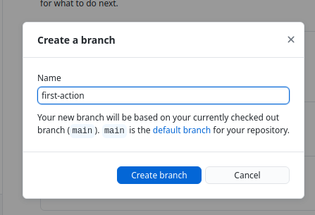

Como se ve en la estructura creamos un fichero Dockerfile. Como vemos es un contenedor Debian que añade a un fichero con una serie de permisos y el ENTRYPOINT apunta al fichero.
 
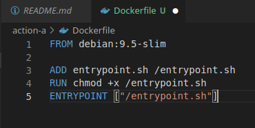

Ahora vamos a crear el fichero entrypoint.que es un script que lanza el siguiente mensaje.

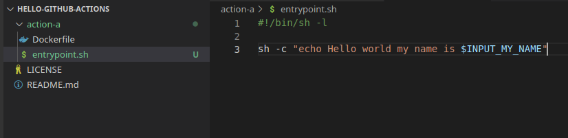

Como se ve en comando usa una variable que vamos a definir en un fichero "action.yml" que vamos a crear en el directorio "action-a".

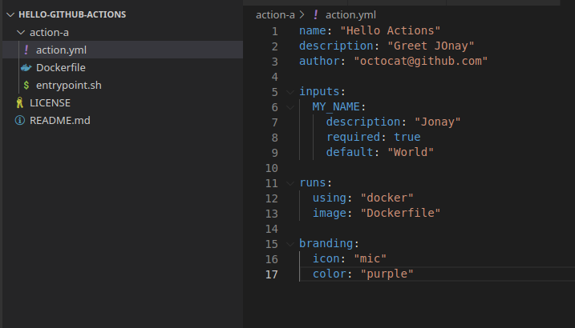

Lo mas importante de este fichero es el apartado "inputs" donde podemos ver la variable declarada.

Con esto realizado vamos a crear el Workflow para ello creamos la capeta "workflow" y dentro el archivo yml.

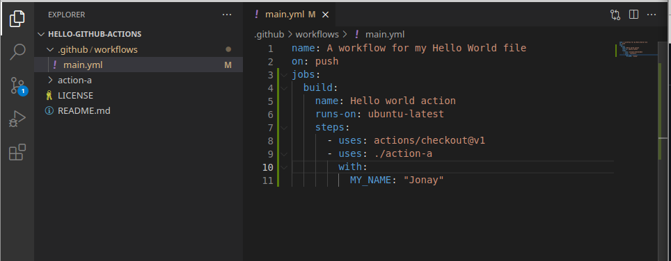

Y ahora realizamos el push para ver como se arrancar el workflow.

Lanzado.

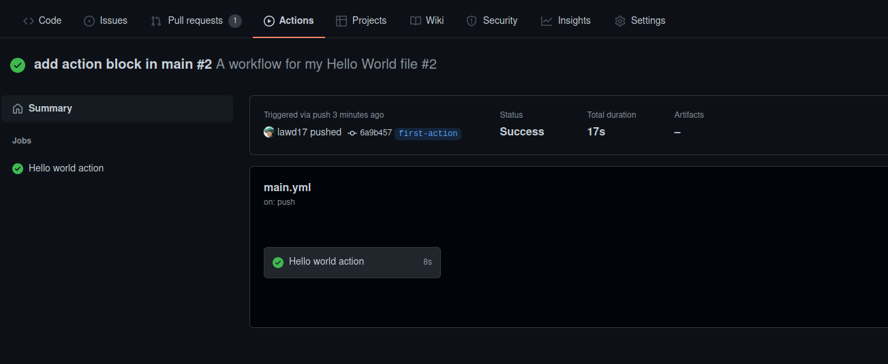

Si realizamos cambios y lanzamos otro push veremos que se vuelve a ejecutar.

Ejecutando.

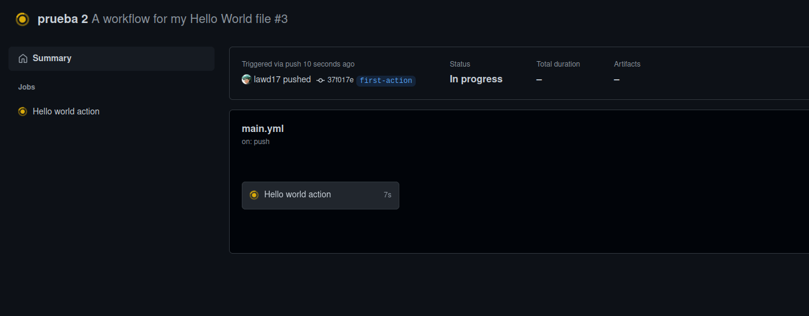

Ejecutado.

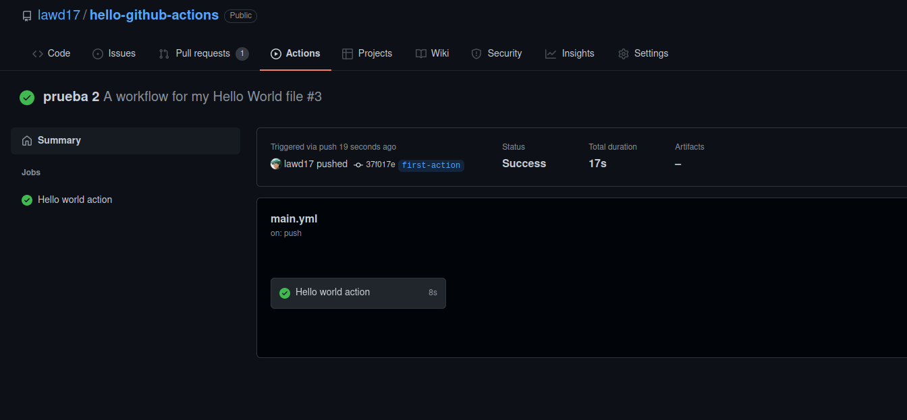

Pestaña action con todas las tareas.

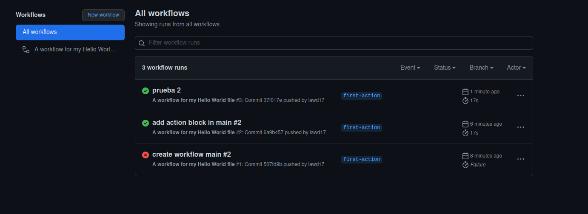

## 6. Marketplace.

El mercado Github contiene multitud de herramientas que te permiten añadir funcionalidades y mejoras a tu flujo de trabajo.

Aqui vemos el inicio de la tienda donde podemos seleccionar la herramienta o filtrar.

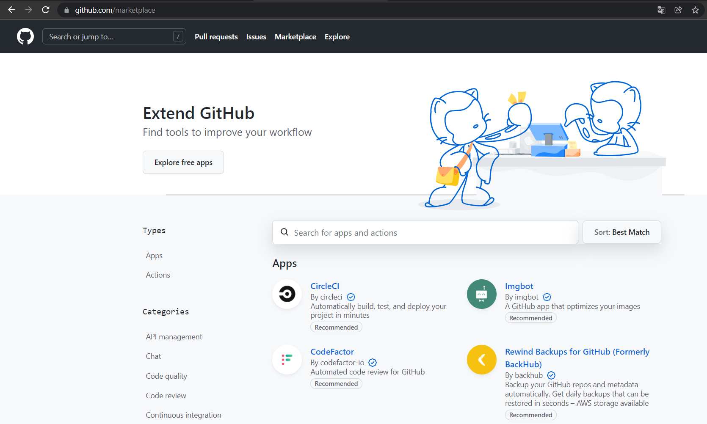

Ejemplo de descarga

Seleccionamos un herramienta.

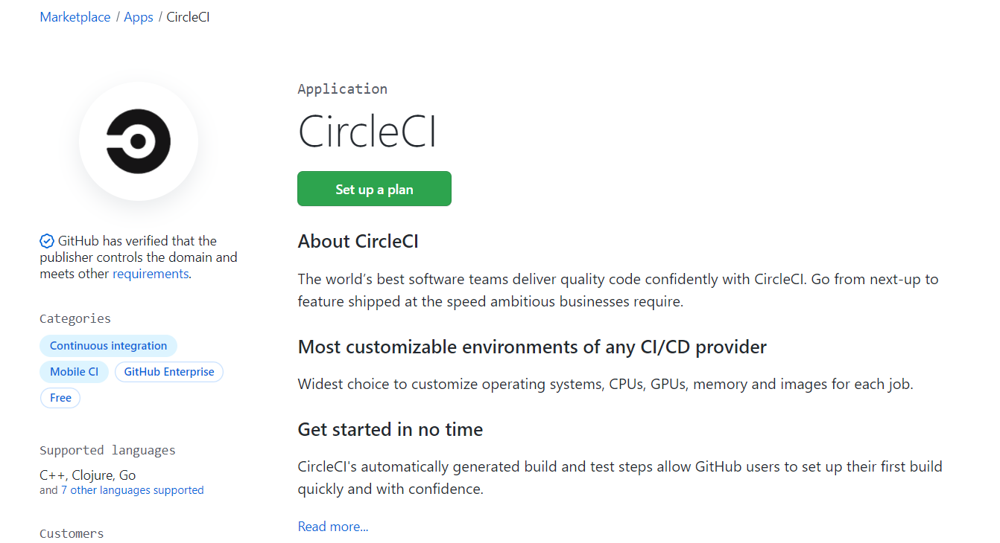

Seleccionamos el plan.

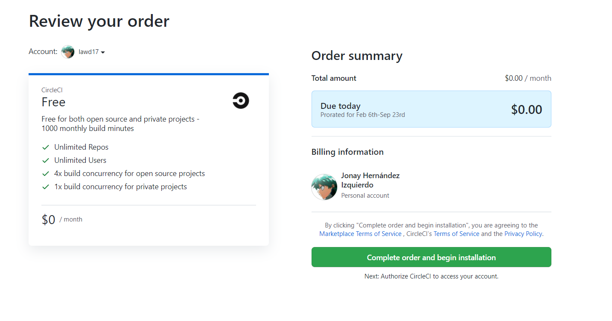

Autorizamos la aplicación.

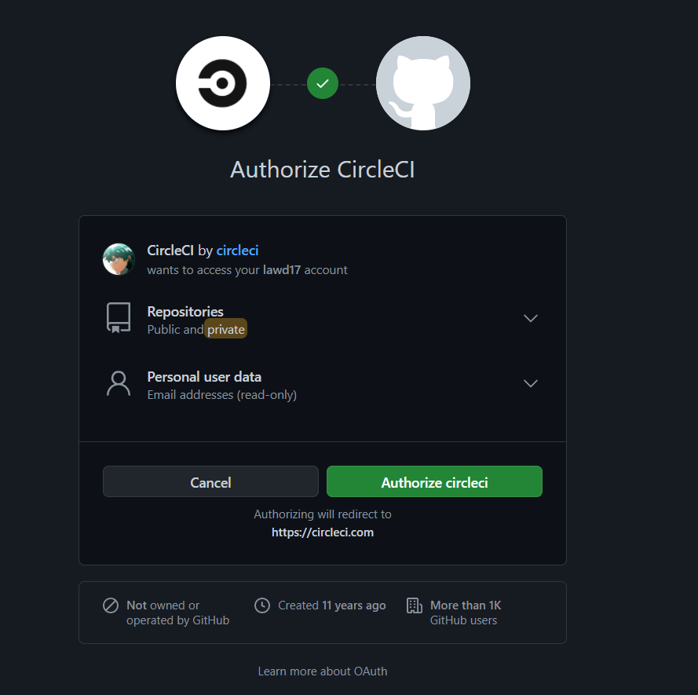
