Daniel de Jesús Álvarez Miranda         2º DAW

# GitLab CI/CD


## Indice

1. [Introducción](#item1) :books:

2. [Integración Contínua](#item2) :construction_worker:

3. [Entrega Contínua](#item3) :car:

4. [Despliegue Contínuo](#item4) :rocket:

5. [Pipelines](#item5) :hammer:

6. [Basic Pipelines](#item6) :vertical_traffic_light:

7. [Herramientas](#item7) :wrench:

8. [Conclusión](#item8) :white_check_mark:

9. [Práctica](#item9)

10. [Referencias](#item10)

<a name = "item1"></a>

## Introducción

---

**GitLab** es una plataforma DevOps basada en web que proporciona un servicio de gestión de repositorios basado en Git, seguimiento de incidencias y funciones de pipeline de integración e implementación continua (CI/CD). Puede gestionar GitLab por sí mismo y desplegarlo en Oracle Cloud Infrastructure (OCI) para automatizar los despliegues en la nube.


<a name = "item2"></a>

## Integración Contínua (CI)

---

La **Integración Contínua (CI)** es considerada una aplicación donde el código es almacenado en repositorios de Git. Los desarrolladores lanzan varias versiones con cambios en el código al día. Por eso, podemos crear un conjunto de Scripts que pueden construir/compilar y testear dichos cambios automáticamente para evitar futuros errores. Esto ayuda a la empresa a ser más productiva y fiable al cliente, y los propios desarrolladores obtienen menos carga de trabajo y teniendo un aumento de agilidad en el trabajo al responder con mayor eficacia ante los errores.

GitLab es un proyecto que usa tanto la integración contínua como el despliegue contínuo. Cada vez que almacenamos el código, se realizan diversos procesos para testearlo.

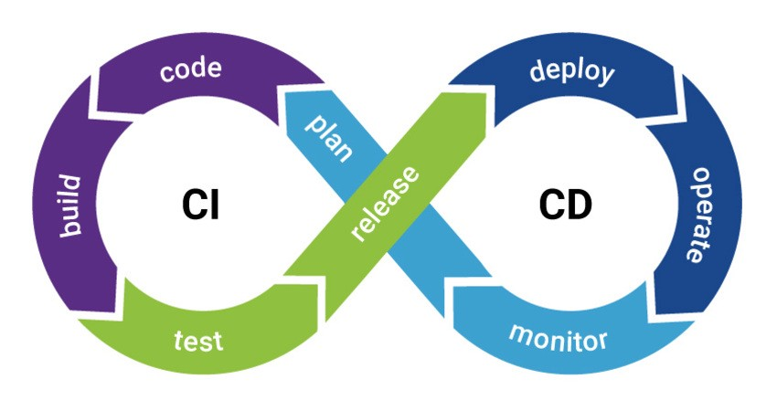

<a name = "item3"></a>

## Entrega Contínua (CD)

---

La **Entrega Continua** es un paso más allá de la Integración Contínua. No solo se testea cada vez que se cree su aplicación o realice cambios, también se despliega continuamente. Sin embargo, con la Entrega Continua, puedes crear triggers/disparadores puedes desplegarlo manualmente.

Con esto, el código es verificado automáticamente pero requiere de intervención humana para activarlo manualmente.

<a name = "item4"></a>

## Despliegue Contínuo (CD)

---

El **Despliegue Contínuo** es un paso más allá de la integración contínua, similar a la entrega contínua. La diferencia es que en lugar de desplegar la aplicación manualmente, se configura para que sea automático. Por lo que no se requiere de intervención humana.

<a name = "item5"></a>

## Pipelines

---


Las **Pipelines** son bloques de construcción fundamentales para CI/CD. Hay tres formas principales de estructuras sus canalizaciones, cada una con sus propias ventajas. Estos pueden mezclarse y combinarse de ser necesario.

Básico: Bueno para proyectos sencillos donde toda la configuración está en un lugar fácil de encontrar.

Directed Acyclic Graph: Bueno para proyectos grandes y complejos que necesitar una ejecución eficiente.

Pipelines secundarios/principales: Bueno para monorepos y proyectos con muchos componentes definidos de forma independiente.


<a name = "item6"></a>

## Basic Pipelines

---

Este es el Pipeline más sencillo de trabajar. Ejecuta todo en la Etapa de compilación al mismo tiempo, y una vez que finaliza, ejecuta todo en la Etapa de prueba de la misma manera, y así sucesivamente. No es el más eficiente, y si tiene muchos pasos o Etapas puede volverse bastante complejo, pero es más fácil de mantener.

Aqui podemos observar un ejemplo básico de una Pipeline.

```console
stages:
  - build
  - test
  - deploy

image: alpine

build_a:
  stage: build
  script:
    - echo "This job builds something."

build_b:
  stage: build
  script:
    - echo "This job builds something else."

test_a:
  stage: test
  script:
    - echo "This job tests something. It will only run when all jobs in the"
    - echo "build stage are complete."

test_b:
  stage: test
  script:
    - echo "This job tests something else. It will only run when all jobs in the"
    - echo "build stage are complete too. It will start at about the same time as test_a."

deploy_a:
  stage: deploy
  script:
    - echo "This job deploys something. It will only run when all jobs in the"
    - echo "test stage complete."

deploy_b:
  stage: deploy
  script:
    - echo "This job deploys something else. It will only run when all jobs in the"
    - echo "test stage complete. It will start at about the same time as deploy_a."
```

<a name = "item7"></a>

## Herramientas

---

GitLab al ser gigantesco, tiene una infinidad de herramientas que trabajan con ella. Las más destacables está empezando por Docker y Kaniko, diferentes bases de datos como Mysql, PostgreSQL, Redis... También estaría Oracle Cloud Infrastructure(OCI). Podríamos estar mencionando muchísimas más herramientas, por lo que la conclusión final es, al ser tan gigante GitLab, no tiene problemas con trabajar en la mayoría de herramientas.

<a name = "item8"></a>

## Conclusión

---

GitLab es una herramienta muy potente que cuenta con vinculación a numerosas aplicaciones. Esta herramienta daría más beneficios a empresas de desarrollo al tener un control absoluto sobre el desarrollo de software. Además, los usuarios que trabajan con GitLab, ven su trabajo más agilizado y automatizado, lo que les hace ser más productivos.


<a name = "item9"></a>

## Práctica
---

Una vez estemos dentro de nuestro GitLab, tenemos 3 opciones. Crear un proyecto en blanco, crear un template con lo necesario o importar un proyecto/repositorio de otras herramientas. Elegimos esta última.

</br>

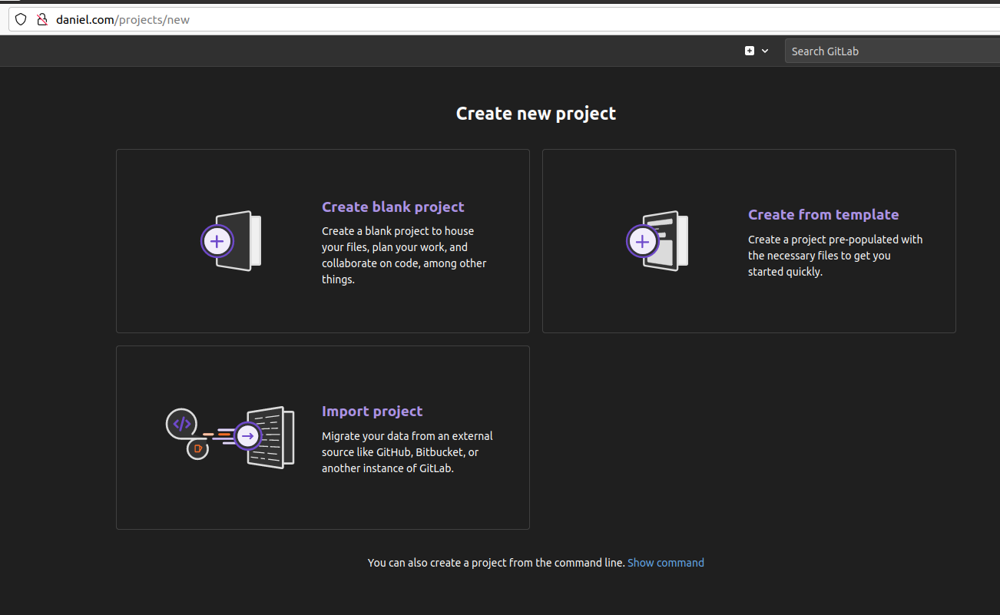

</br>

Cuando vayamos a importar, debemos elegir desde donde queremos hacerlo. En nuestro caso, será GitHub. Tendremos que ir a nuestro GitHub y crear un Token para el repositorio que queramos importar. Y una vez puesto el token el GitLab, tendremos que definir los permisos que tiene GitLab sobre el repositorio. En nuestro caso podrá leer y modificar el repositorio únicamente.

</br>

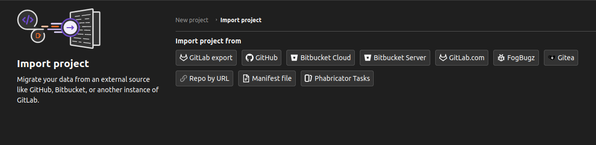

</br>

Una vez terminado, veremos como el repositorio de nuestro GitHub está importado en GitLab y podemos trabajar en él.

</br>

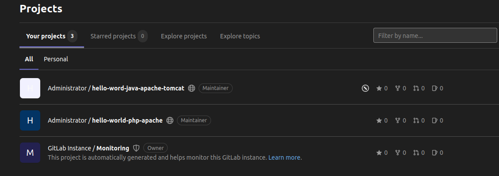

</br>

Si entramos en nuestro repositorio, vemos que podemos subir archivos e incluso, crear por defecto archivos como README. Uno de los potenciales de GitLab, es que trabaja con muchísimas herramientas. Podemos verlo si vamos a la **Configuración de Integración.**

</br>

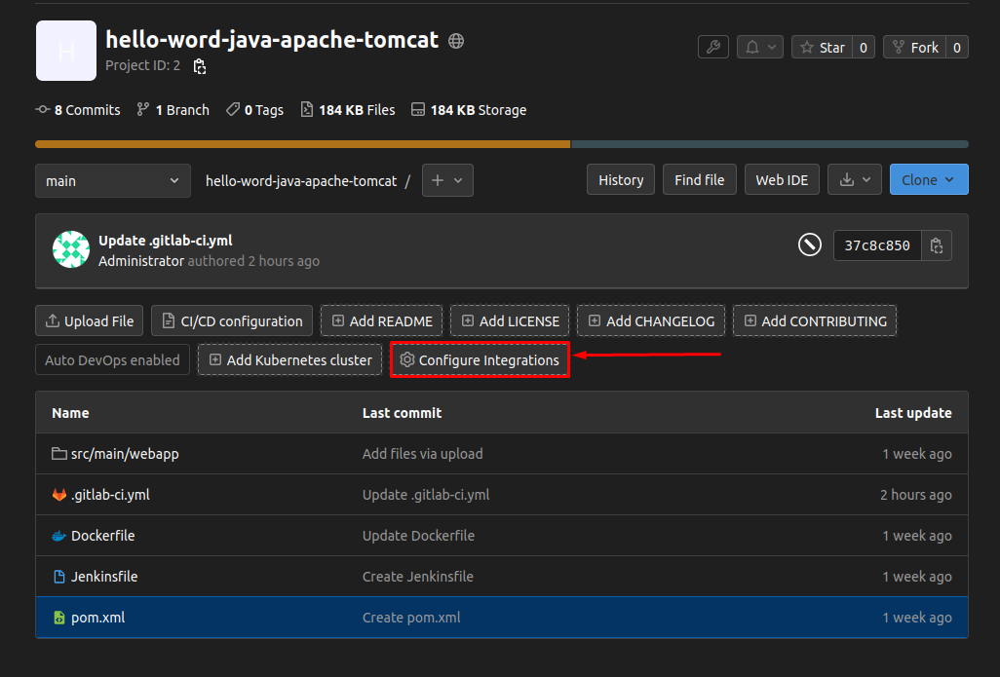

</br>

Como podemos ver a continuación, trabaja con numerosas herramientas para facilitarnos tanto la **Integración Contínua** como el **Despliegue Contínuo**.

</br>

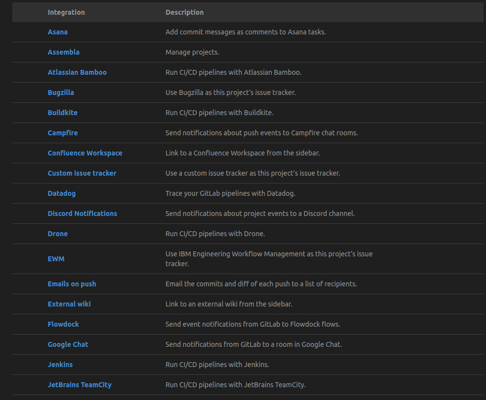

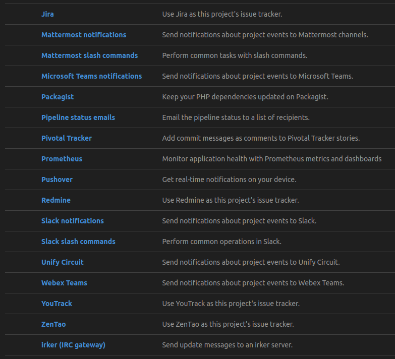

</br>

Para crear una Pipeline, tendremos que crear un archivo de texto en nuestro repositorio. Tendremos que elegir la extensión **".gitlab-ci.yml"** para que GitLab pueda reconocerlo y crear la Pipeline.

</br>

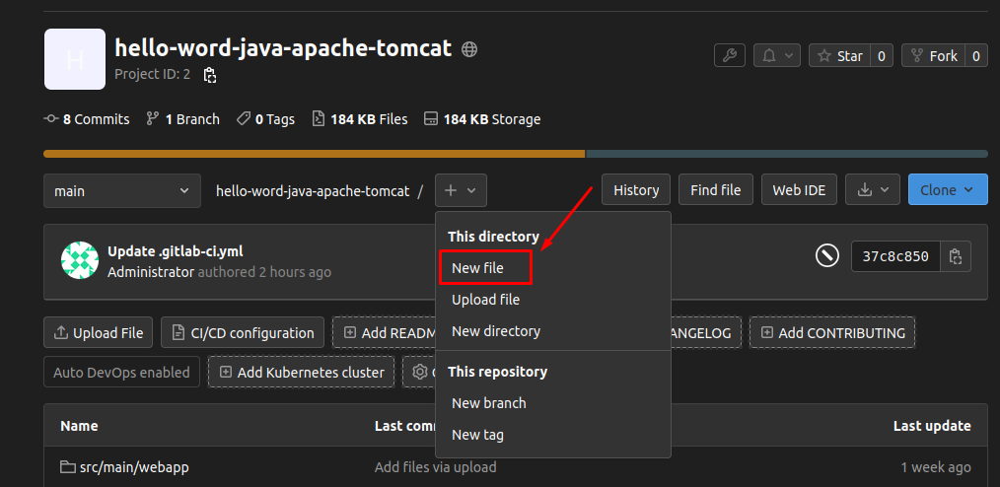

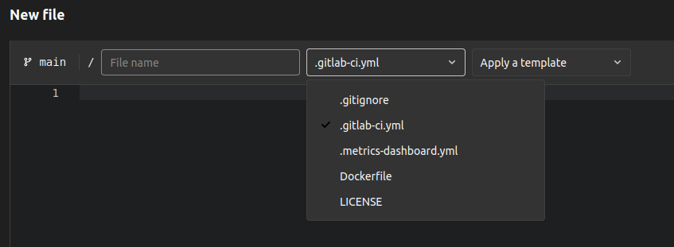

</br>

Algo bastante potente que descrubí, eran los templates a la hora de crear un Pipeline. Como podemos observar, tenemos templates de todo tipo.

</br>

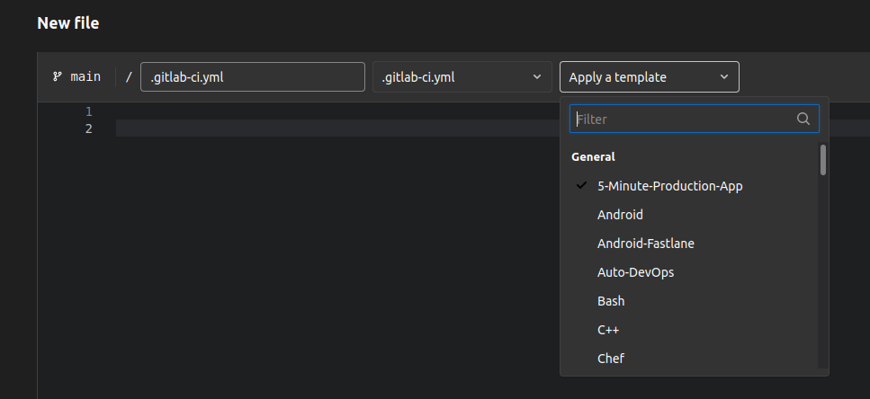

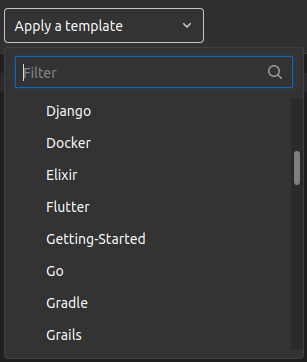

</br>

Elegimos el template de PHP.

</br>

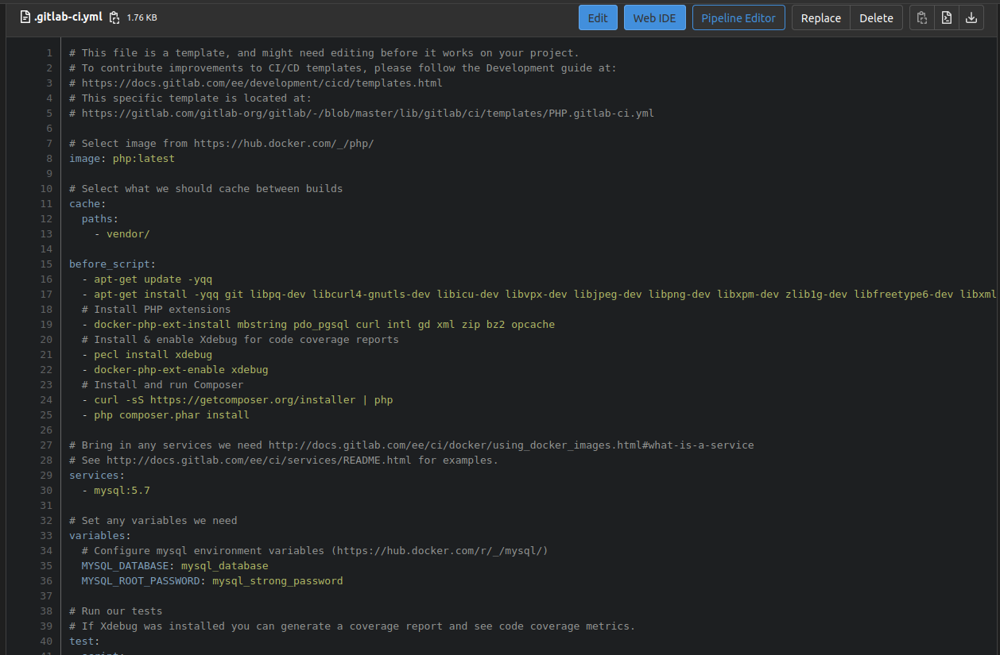

</br>

Una vez creado el archivo, solo queda lanzar el Pipeline para que realice las etapas de construcción, testeo y despliegue.

</br>

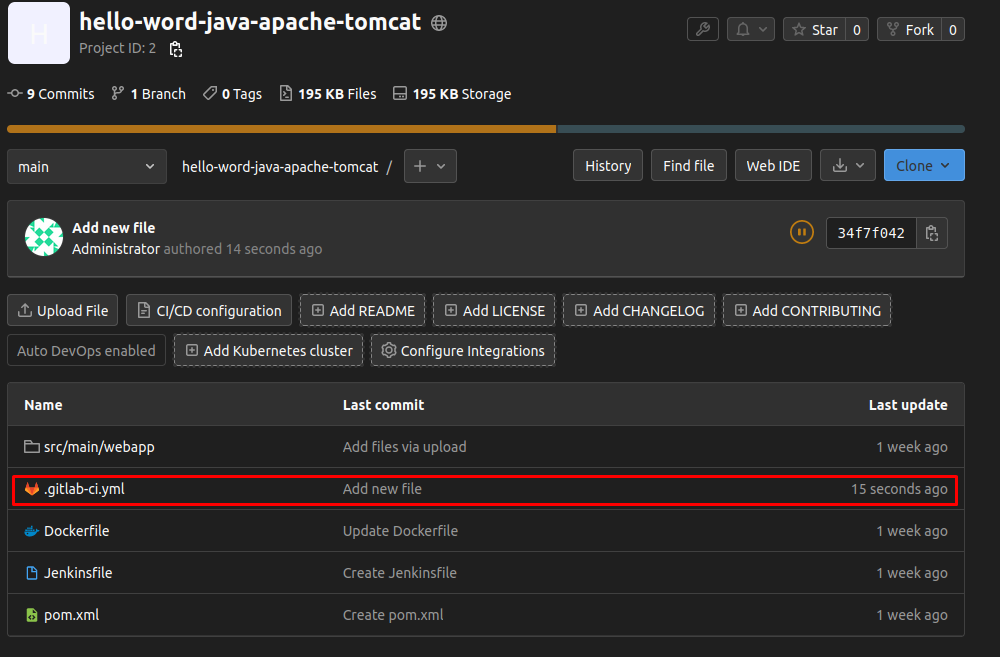

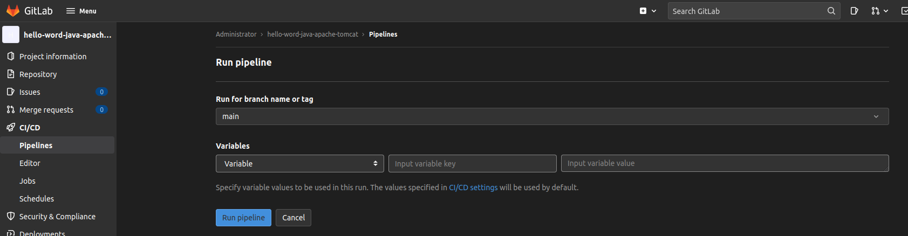

</br>

*Advertencia: Para poder iniciar la Pipeline, necesitas tener configurado los "runners" y dado que aunque pude instalar y configurar uno, nunca supe como hacer que ejecutara la Pipeline de nuestro repositorio, asique he cogido de un vídeo, imágenes para ayudar a ilustrar. Abajo pongo la referencia al vídeo.*

</br>

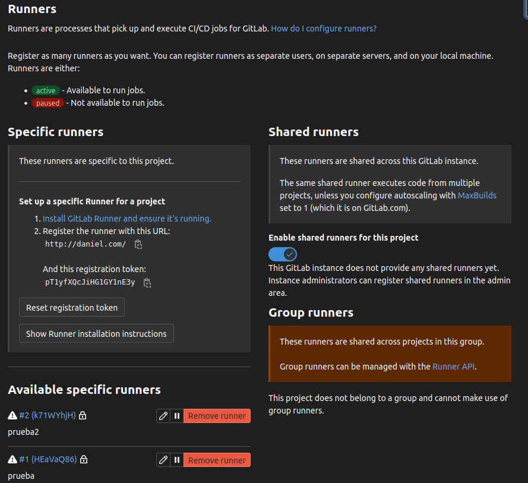

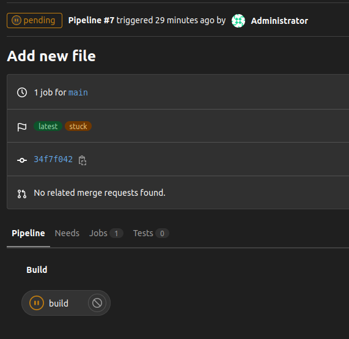

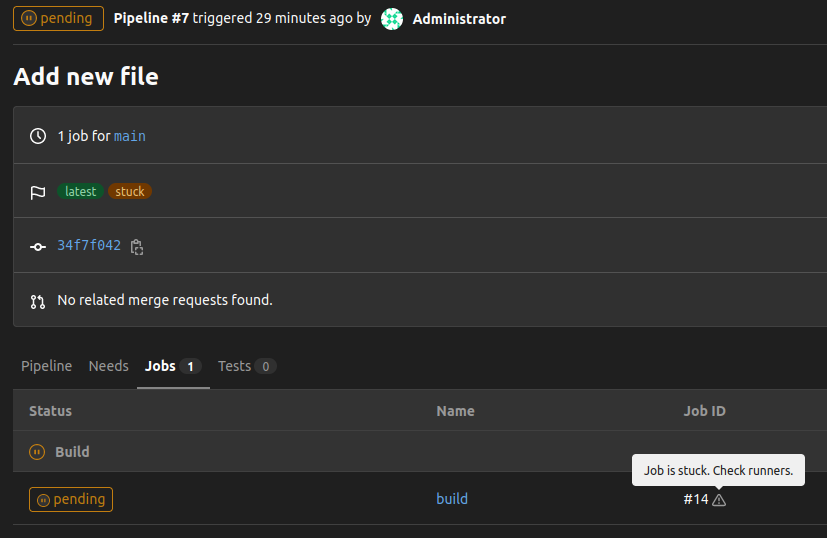

</br>

Volvemos a construir un Pipeline pero esta vez mucho más básico. El siguiente Pipeline solo contendrá dos etapas: construir/compilar y testear. En dichas etapas, solo haremos un echo.

</br>

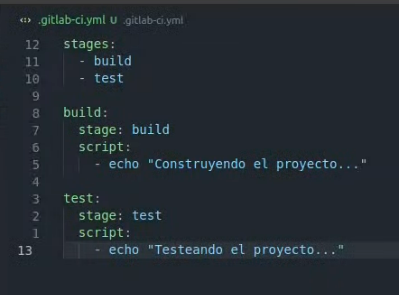

</br>

Comprobamos que la Pipeline ha ido bien y vemos el resultado de nuestro echo en la línea 21.

</br>


</br>

Ahora volvemos a nuestro archivo de configuración, y añadimos los comandos de crear un directorio llamado build y dentro de éste, cree un fichero de configuración en JSON.

Los test tendrán que comprobar que existen dichos directorios y ficheros.

</br>

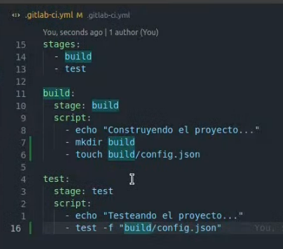

</br>

Vamos a la vista general y vemos que los test han fallado. Si vamos a la consola de los logs, vemos que el test falló porque no encontró ningún directorio o fichero que debería haberse construido en la etapa anterior. Esto se debe a que por temas de seguridad, cada etapa es independiente y no está "vinculada" con las demás.

</br>

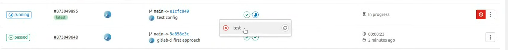

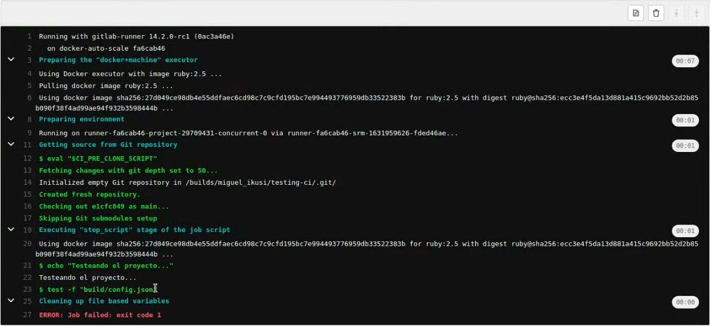

</br>

Para arreglar esto, debemos añadir en nuestro archivo, el elemento "artifacts" con la ruta del archivo. Esto hará visible para otras etapas dicha ruta.

</br>


</br>

Y como podemos observar, ahora han pasado los test y está todo correcto.

</br>

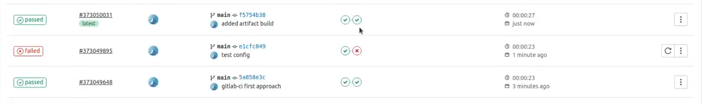

</br>

<a name = "item10"></a>

# Referencias
---

</br>

https://docs.gitlab.com/

https://www.youtube.com/watch?v=2W95rnyU6co