

<h1 style="text-align: center;"> GoCD

</h1>

- Realizado por: Rubén Ruiz Pérez

- Github: [@rubenrzpz](https://github.com/rubenrzprz)

- Información extraída de la [web oficial de GoCD](https://www.gocd.org/)

***

## Índice

- [1. Introducción](#1-introducción)
- [2. Conceptos](#2-conceptos)
- [3. Instalación de GoCD](#3-instalación-de-gocd)
- [4. Creación de un Pipeline](#4-creación-de-un-pipeline)
- [5. Pipeline de ejemplo](#5-pipeline-de-ejemplo)
- [6. Enlaces de interés para aprender más](#6-enlaces-de-interés-para-aprender-más)

***

## 1. Introducción

***

GoCD es un sistema de Integración Continua y Despliegue Continuo (CI/CD) gratuito y de código libre.

> [¿Qué es CI/CD?](https://github.com/jpexposito/docencia/tree/master/DPL/DESPLIEGUE#qu%C3%A9-es-cicd)
>
> Se trata de una práctica empleada en metodologías ágiles que permite cumplir los requerimientos, hacer código de calidad y que la aplicación sea segura de usar. Incorpora una automatización continua y un control permanente del ciclo de vida de la aplicación.
>
> ***CI (Continuous Integration)***: se integran los cambios en el código a la rama principal de un repositorio común. Se evita que se cree código de manera ailsada y contribuye a que las integraciones sean más rápidas y con mayor frecuencia.
>
> ***CD (Continuous Deployment)***: automatiza la entrega de aplicaciones, permitiendo implementaciones fáciles y confiables, eliminando los procesos manuales.

### Características de GoCD

- Se ejecuta usando Java Virtual Machine.
- Los ficheros de configuración tienen formato XML.

#### Ventajas

- Gratuito y de código libre.
- Documentación detallada y tutoriales desde el sitio oficial.
- Creación de pipelines desde la interfaz gráfica y desde ficheros YAML o JSON.

#### Desventajas

- Díficil de manejar al principio.
- Menos soporte y comunidad que otras herramientas similares.

## 2. Conceptos

***

### **(Build) Task**

Acción que se debe ejecutar, normalmente, un único comando. Por ejemplo:

> ``mvn clean test``

> ``crear_package.sh``

### **Job**

Conjunto de tasks que se ejecutan secuencialmente. Si una de las *tasks* falla, el *job* se considera fallido.
Además, el resto de *tasks* no se ejecutarán, a no ser que se especifique lo contrario.

Cada tarea se ejecuta como un programa independiente, por lo que, aunque una de las tareas modifique alguna de sus variables de entorno, estos cambios no afectarán a las siguientes tareas.

Por otro lado, los cambios hechos en el sistema de ficheros sí que serán efectivos para las subsiguientes tareas.

> 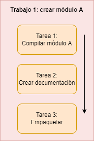

### **Stage**

Agrupación de *jobs*. Cada trabajo se ejecuta independientemente de los demás *jobs* de la *stage*.

Si uno de los *jobs* falla, se considera la *stage* como fallida. Sin embargo, los demás trabajos seguirán ejecutándose, puesto que son independientes los unos de los otros.

> 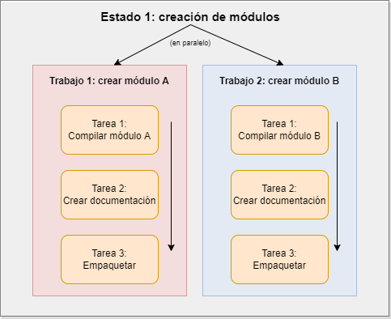

### **Pipeline**

Conjunto de *stages* que se ejecutan uno detrás de otro. Si falla uno de los *stages*, el pipeline se considerará fallido y el resto de *stages* no se ejecutarán.

> 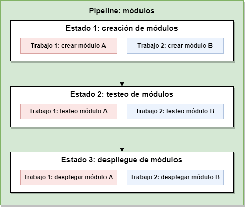

### **Materials**

Son disparadores de los *pipelines*. Pueden ser tanto repositorios de código (Git, SVN, Mercurial...) como temporizadores, esto es, disparadores que ejecutan los pipelines cada cierto tiempo. Cada pipeline puede tener varios *materials*.

> 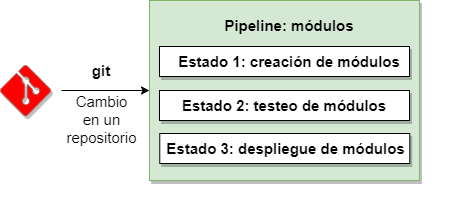

Además, un pipeline puede servir como *material* a otro pipeline, es decir, tras terminar un *stage* determinado, se puede lanzar otro pipeline.

> 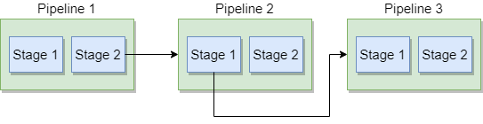

#### **Fan-out**

> Circuntancia en la que el cumplimiento de un *material* causa que se lancen múltiples pipelines.
>
> 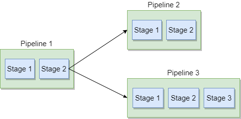

#### **Fan-in**

> Particularidad de un pipeline por la cual requiere que se completen varios *materials* para poder ser lanzado.
>
> 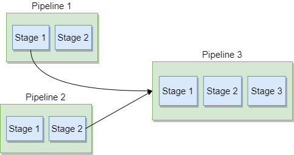

### **Value Stream Map (VSM)**

Es un mapeado de un pipeline con todas sus dependencias y las acciones que desencadena. Es usado por el servidor de GoCD para determinar cuando lanzar cada pipeline.

> 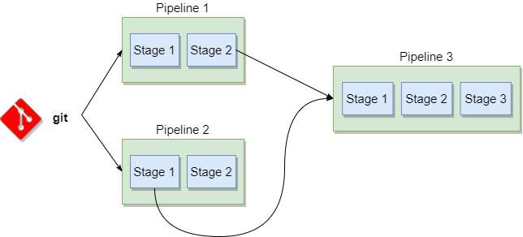

### **Artifacts**

Archivos o directorios que pueden publicar los *jobs*. Desde que un *job* es ejecutado, el servidor GoCD publica los artefactos generados por ese trabajo para que sean accesibles para otras etapas o pipelines.

#### **Fetch Artifact Task**

> Es una tarea especial que provee GoCD que permite obtener artefactos de cualquier ancestro del pipeline.

### **Agents**

Son los encargados de ejecutar las tareas. Cuando se desencadena un pipeline, las tareas son asignadas por el servidor GoCD a los agentes para que las realicen.

#### **Resources**

> Etiquetas que se añaden a los agentes y a los *jobs* para determinar sus características.
>
> En los agentes, indican qué tareas pueden realizar. Por ejemplo, un recurso de un agente podría ser `Linux`, indicando que trabaja sobre un sistema Linux.
>
> Los trabajos a su vez, también pueden tener recursos, indicando qué tipo de agente debe realizarlos.
>
> 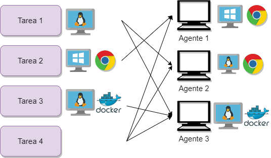
>
> - La tarea 1 requiere Linux, por lo que la pueden realizar tanto el agente 2 como el 3.
>
> - La tarea 2 requiere Windows y Google Chrome, por lo que tan solo la puede realizar el agente 1.
>
> - La tarea 3 precisa Linux y Docker, así que deberá realizarla el agente 3.
>
> - La tarea 4 no tiene ningún recurso asociado, por lo que la puede realizar cualquier agente indistintamente.

### **Enviroments**

Entornos que agrupan y aíslan a los pipelines y los agentes, ya que restringen que:

> 1. Cada pipeline esté asociado a un máximo de un entorno.
>
> 2. Un agente pueda asociarse con 0 o múltiples entornos.
>
> 3. Un agente solo pueda ejecutar trabajos que pertenezcan a pipelines con los que está asociado.
>
> 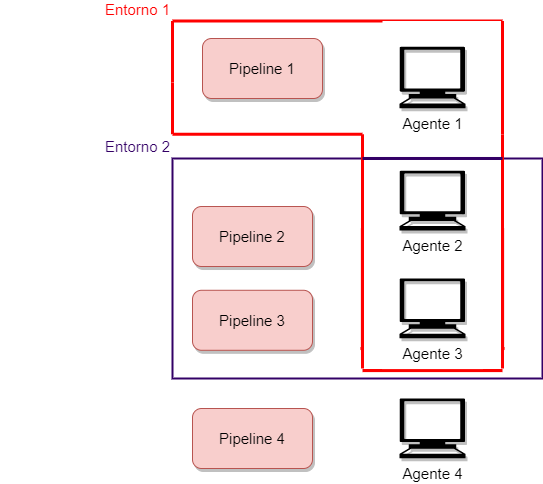
>
> - Los jobs de la pipeline 1 pueden ser tomados por el agente 1, 2 o 3.
>
> - Los jobs de las pipelines 2 y 3  solo pueden ser tomados por los agentes 2 y 3.
>
> - El pipeline 4 no pertenece a ningún entorno, por lo que sus tareas solo pueden ser ejecutadas por agentes que no estén asociados a ningún entorno, es decir, el agente 4.

### Environment Variables

Son variables definidas por el usuario y están disponibles para las tareas como cualquier otra variable de entorno del propio sistema donde se ejecute.

Se pueden definir variables de entorno a nivel de *enviroment*, de *pipeline*, de *stage* y de *job*.

> Las variables siguen un sistema de cascada, por lo que si se define una variable a nivel de *job*, sobrescribe el valor de la misma variable declarada en un nivel superior.
>
> 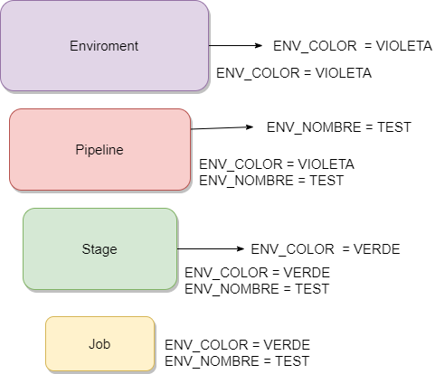

## 3. Instalación de GoCD

***

GoCD se compone de dos componentes instalables: un GoCD Server y uno o varios GoCD Agents.

Se debe disponer de al menos un agente para poder realizar las tareas.

- [Requisitos del sistema](https://docs.gocd.org/current/installation/system_requirements.html)
- [Instalación de GoCD Server](https://docs.gocd.org/current/installation/installing_go_server.html)
- [Instalación de GoCD Agent](https://docs.gocd.org/current/installation/installing_go_agent.html)

Los puertos que usa GoCD Server son el puerto 8153 para HTTP y el 8154 para HTTPS.

> Los agentes no tienen porque estar instalados en el mismo sistema que el Server. El único requisito es que los puertos 8153 y 8154 sean accesibles para los nodos en los que están instalados los agentes.

### Configuración del Server en Linux

Una vez instalado, basta con ejecutar el comando

> ``service go-server start``

para arrancar el servidor como un demonio del sistema.

Otros comandos útiles para manejar el servidor:

> | Comando | Uso |
> | :-: | :-: |
> | ``service go-server console`` | Arranca el servidor en primer plano a través de una consola, en lugar de como un demonio. |
> | ``service go-server stop`` | Detiene el servidor. |
> | ``service go-server restart`` | Reinicia el servidor. |

Accedemos a nuestro servidor a través de ``http://localhost:8153``.

> Nota: se puede configurar un proxy inverso de manera muy sencilla. [Tutorial en Apache y Nginx.](https://docs.gocd.org/current/installation/configure-reverse-proxy.html)

### Configuración de un agente en Linux

Una vez instalado el agente, se debe configurar para poder usarse.

1. Abrimos el fichero /usr/share/go-agent/wrapper-config/wrapper-properties.conf con un editor de texto.

2. Indicamos la URL de nuestro GoCD Server.

>  <a name="config-path">También es conveniente establecer la variable de entorno PATH dentro del agente, ya que toma el valor por defecto para el sistema operativo en lugar de su valor actual. Esto nos permitirá ejecutar comandos como ``mvn`` sin especificar la ruta completa del comando.</a>
>
> 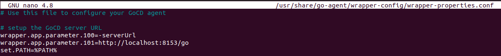

3. Guardamos el fichero.

4. Arrancamos el agente mediante el comando:

  > ``service go-agent start``

5. Accedemos a nuestro servidor GoCD y nos dirigimos a la pestaña *Agents*.

6. Nos aparecerá el agente en la lista. Para habilitarlo, lo seleccionamos y hacemos click en 'Enable'.

> 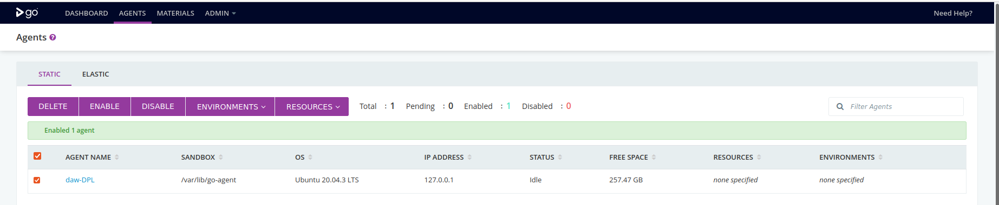

## 4. Creación de un pipeline

***

Se pueden crear pipelines de las siguientes maneras:

- Mediante ficheros en formatos YAML, JSON o Groovy.
- Mediante una [API de GoCD](https://api.gocd.org/current/#create-a-pipeline).
- Usando la interfaz de usuario de GoCD.
- Clonando una pipeline existente.

Para este ejemplo, usaremos la interfaz de usuario de GoCD, puesto que es la forma más interactiva y sencilla para empezar.

1. Para crear un pipeline, nos dirigimos a la pestaña *Admin*>*Pipelines*>*Add new pipeline*.

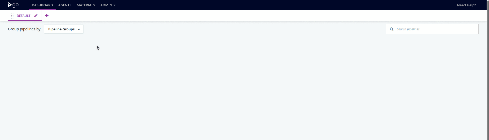

2. Elegimos el material que desencadenará el pipeline, para este ejemplo, un repositorio de Git.

> Podemos comprobar que GoCD encuentra el repositorio mediante el botón *Test Connection*.

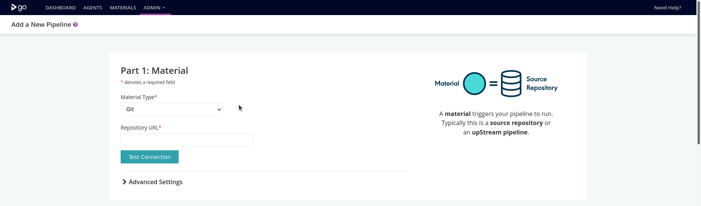

Dentro del apartado de ajustes avanzados, podemos configurar lo siguiente:

- Rama del repositorio a usar.

- Usuario y contraseña de Git.

> **¡CUIDADO!** Si no se emplea el protocolo HTTPS, las claves que introducidas no estarán cifradas, por lo que pueden ser capturadas a través de la red.

- *Shallow clone*: permite realizar copias superficiales del repositorio, es decir, únicamente recoge los últimos commits, en lugar de todo el historial. Esta opción es muy útil para repositorios grandes, cuyas copias se pueden demorar mucho tiempo.

- Ruta alternativa donde clonar el repositorio. Por defecto, los repositorios se clonan en la raíz del directorio de trabajo del pipeline, sin embargo, en este apartado se puede específicar una ruta diferente.

- Etiqueta para identificar el material más fácilmente.

- Comportamiento del sondeo del repositorio:
  - Regularmente (por defecto). El servidor buscará los cambios en el repositorio automáticamente.
  - Manual. El pipeline solo se ejecutará cuando se llama manualmente.

- *Denylist*: define rutas que no se tendrán en cuenta a la hora de desencadenar un pipeline, es decir, los cambios en estos directorios y/o ficheros no lanzarán la ejecución del pipeline. También se puede configurar al revés, es decir, que solo los cambios en las rutas desencadenen el pipeline.

3. Una vez configurado el material, definimos el nombre del pipeline.

> Además, debemos establecer el grupo al que pertenece el pipeline. Adicionalmente, podemos incorporar plantillas para crear el pipeline y definir variables de entorno.

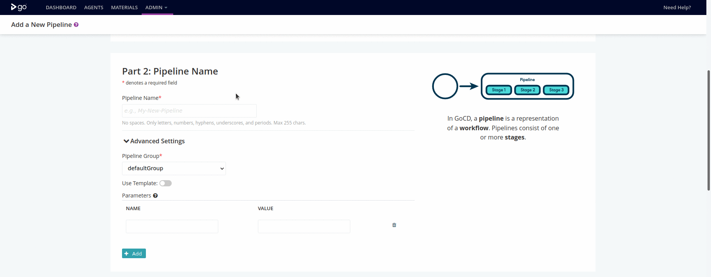

4. El siguiente paso es configurar el primer stage. De momento bastará con asignarle un nombre.

> También se puede configurar si el stage se ejecuta automáticamente al finalizar los pasos anteriores (por defecto), o si solo puede ser lanzado manualmente.

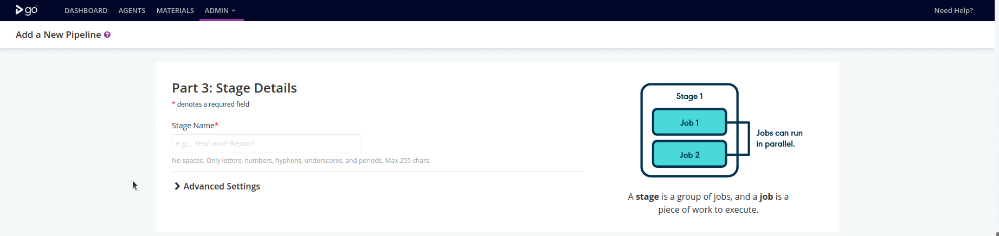

5. Por último, debemos configurar el primer trabajo del stage y sus tareas. Definimos un nombre para el trabajo y los comandos a ejecutar.

> Adicionalmente, podremos definir variables de entorno para el trabajo.

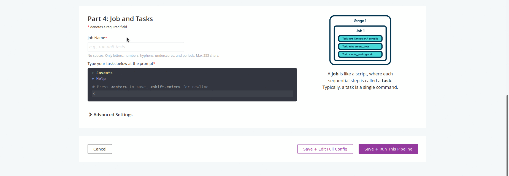

6. Guardamos los cambios y pasamos a editar el pipeline al completo (Save + Edit Full Config).

Desde esta interfaz podremos, entre otras opciones, añadir más stages y trabajos, configurar las tareas y definir los artefactos que se van a generar.

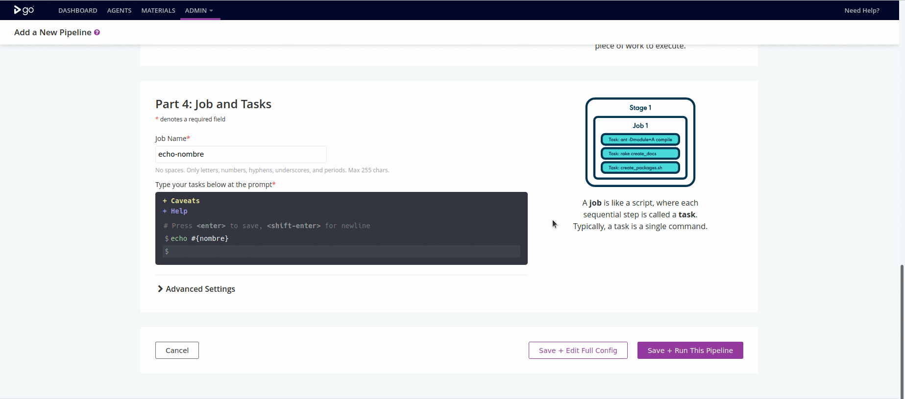

7. Una vez que hayamos terminado de configurar nuestro pipeline, podemos lanzarlo desde nuestro Dashboard.

## 5. Pipeline de ejemplo

***

El siguiente [pipeline](https://github.com/rubenrzprz/gocd-pipelines/blob/master/war-deployment-docker/deploy-war.gocd.yaml) despliega una aplicación JSP a través de un contenedor de docker con una imagen de Tomcat.

> Para poder usar este pipeline, nuestro agente debe cumplir los siguientes requisitos:
>
> - Sistema operativo Ubuntu (testeado en Ubuntu 20.04).
> - Tener instalado Docker Compose y Maven.
> - Añadir la ruta de Maven a la variable PATH en el archivo de configuración de GoCD Server. [Más detalles](#config-path).
> - Añadir el usuario "go" al grupo "docker".
>   - ``sudo usermod -aG docker go``
> - Configurar /etc/sudoers para permitir a GoCD ejectutar el comando chown como sudo. Para ello, hay que añadir la siguiente línea al final del fichero /etc/sudoers.
>   - ``go ALL=(ALL) NOPASSWD: /bin/chown``

Accedemos a la pestaña *Admin>Config Repositories>Add* e introducimos la siguiente información:

| Campo | Valor |
| :-: | - |
| *Repository name* | El que queramos asignarle, por ejemplo: *pipelines-prueba* |
| *Plugin ID* | YAML Configuration Plugin |
| *Material type* | Git |
| *URL* | https://github.com/rubenrzprz/gocd-pipelines |
| *GoCD YAML files pattern* | Aquí introduciremos la URL relativa del fichero (*war-deployment-docker/deploy-war.gocd.yaml*) o podemos usar el comodín **\*** para indicar que queremos importar cualquier fichero .gocd.yaml dentro de cualquier carpeta: ***\*/\*.gocd.yaml***
| *Rules* | Añadiremos una directiva *Allow* de tipo *Pipeline Group* para todos los recursos *(\*)*.

Nos ha de quedar la siguiente configuración:

> 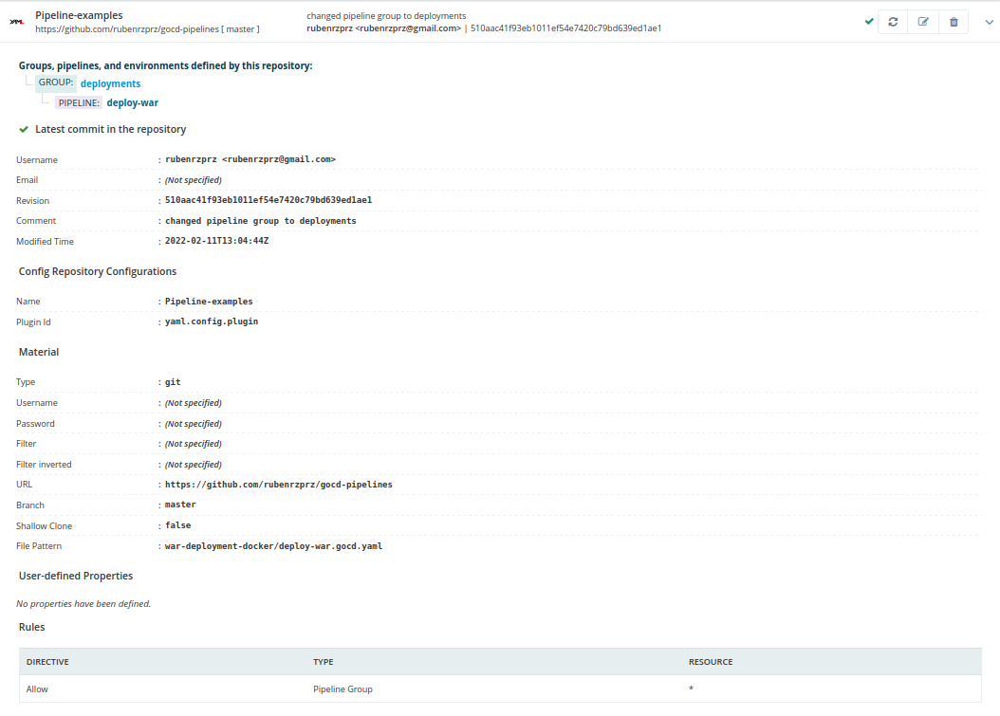

De este modo, ya tendríamos nuestro pipeline listo para ser lanzado desde GoCD Server.

> 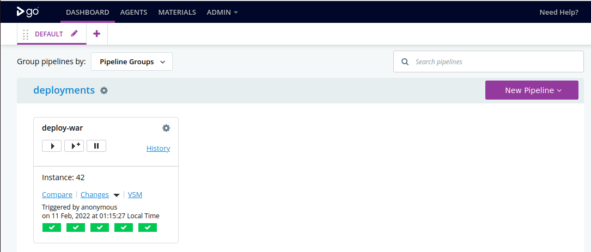

## 6. Enlaces de interés para aprender más

***

- [Integración con bases de datos H2, PostgreSQL y MySQL](https://docs.gocd.org/current/installation/configuring_database.html).
- [Backups del Server GoCD](https://docs.gocd.org/current/advanced_usage/one_click_backup.html).
- [Ampliación mediante plugins](https://docs.gocd.org/current/extension_points/).
- [Configuración de roles y usuarios](https://docs.gocd.org/21.4.0/configuration/dev_authorization.html#specifying-permissions-for-pipeline-groups)

