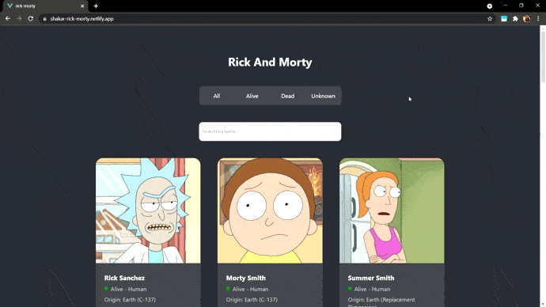

<h1 align="center">Rick and Morty</h1>

<p align="center">
  
</p>

<p align="center">
  
  
  
</p>

## Project setup
```
yarn install
```

### Compiles and hot-reloads for development
```
yarn serve
```

### Compiles and minifies for production
```
yarn build
```

### Customize configuration
See [Configuration Reference](https://cli.vuejs.org/config/).
